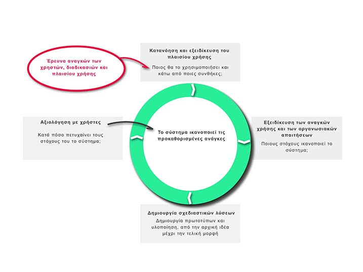
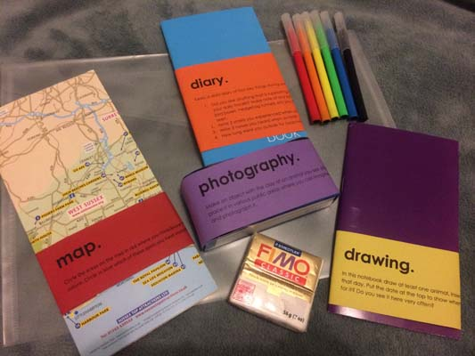
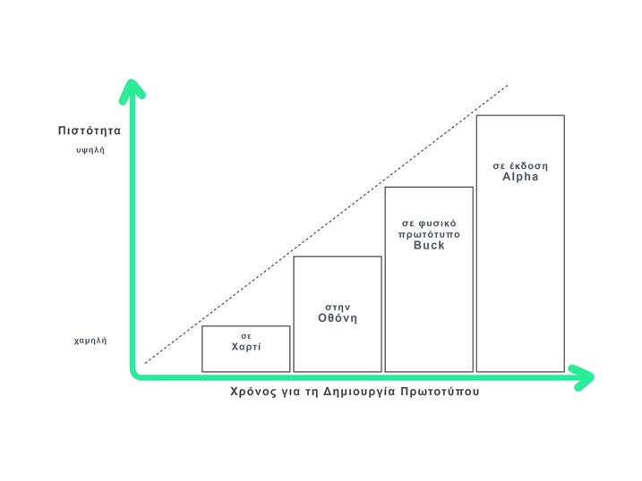
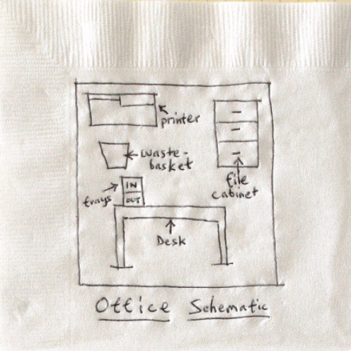
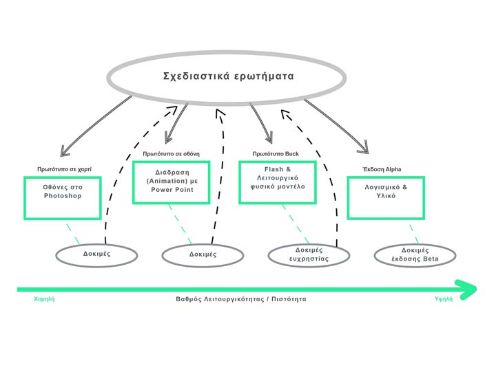
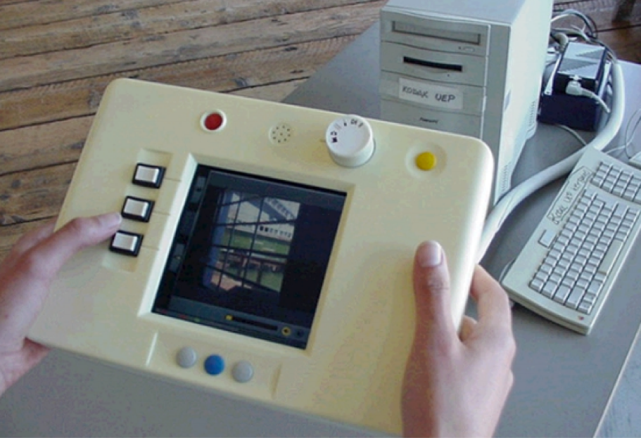
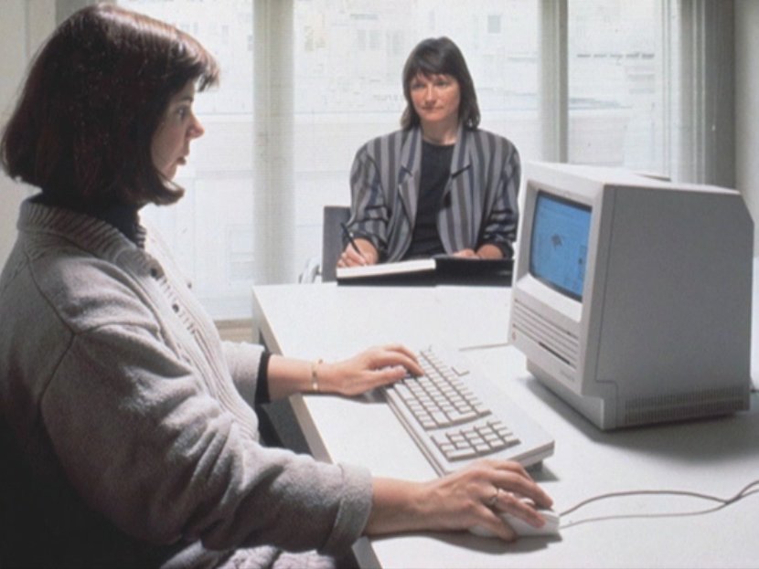
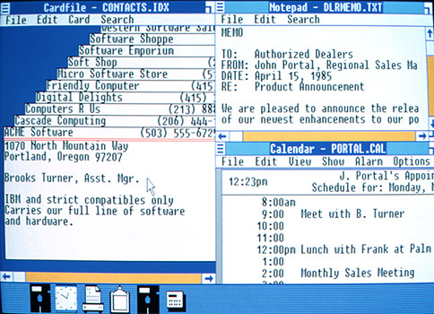
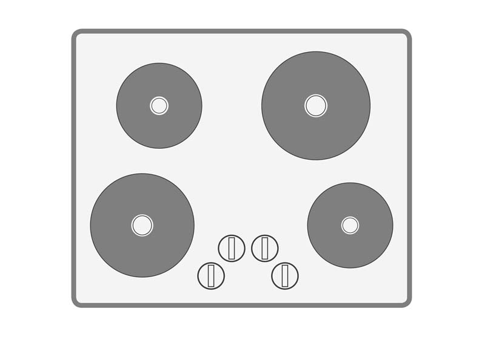

# Μέθοδος

> Κάνοντας σωστά τη σωστή σχεδίαση.
- Bill Buxton (1949)

Η ανθρωποκεντρική σχεδίαση έχει στόχο τη σχεδίαση και τη βελτίωση των συστημάτων διάδρασης ανθρώπου-υπολογιστή. Οι περισσότερες τεχνικές, κυρίως στην πρακτική εφαρμογή τους, δίνουν έμφαση στη βελτίωση συστημάτων που υπάρχουν ή συστημάτων που βρίσκονται στο στάδιο της σχεδίασης. Η βελτιστοποίηση ενός συστήματος είναι ένα σημαντικό θέμα, αλλά ακόμη σημαντικότερο είναι το να αποκτήσουμε την αυτοπεποίθηση της καταλληλότητας των προδιαγραφών του. Για αυτόν τον σκοπό, τόσο αυτό το κεφάλαιο όσο και τα υπόλοιπα κεφάλαια του βιβλίου εστιάζουν περισσότερο στην επανάληψη των βημάτων, παρά σε αυτά καθαυτά τα βήματα που συνιστούν τον κύκλο της ανθρωποκεντρικής σχεδίασης.

Ίσως έχετε συναντήσει ξανά τον όρο της ανθρωποκεντρικής σχεδίασης της διάδρασης ανθρώπου-υπολογιστή με έμφαση στη μοντελοποίηση του χρήστη και με σκοπό την αυτοματοποίηση των διεργασιών του. Σε αυτήν την ενότητα η έμφαση δε δίνεται στη μοντελοποίηση των δεξιοτήτων και της συμπεριφοράς του χρήστη, ούτε στην αυτοματοποίηση των δραστηριοτήτων του (έμμεση διάδραση). Η έμφαση της ανθρωποκεντρικής σχεδίασης στην παρούσα ενότητα δίνεται στη σχεδίαση και υλοποίηση της διάδρασης με συσκευές χρήστη για τις περιπτώσεις όπου απαιτείται η ενεργή συμβολή του χρήστη (άμεση διάδραση).

Στην προηγούμενη ενότητα είδαμε τι είναι η διάδραση με συσκευές και ποιες μορφές έχει πάρει τα τελευταία χρόνια. Εδώ θα μελετήσουμε το πώς θα σχεδιάσουμε τη διάδραση. Αν και μας ενδιαφέρει η σχεδίαση των συστημάτων διάδρασης, θα εστιάσουμε περισσότερο στη σχεδίαση της διάδρασης μεταξύ ανθρώπου και συσκευής, με την έννοια ότι αυτή η διάδραση εξαρτάται εξίσου από την αντίληψη που έχει ο άνθρωπος για τη συσκευή, όσο και από τις λειτουργίες και την εμφάνιση της αντίστοιχης συσκευής. Είναι σημαντικό να κατανοήσουμε ότι η λεπτομερής σχεδίαση της διάδρασης πριν την υλοποίηση των αντίστοιχων λειτουργιών του συστήματος μπορεί να προσφέρει αποτελεσματικότερη διάδραση και επιπλέον μειωμένο κόστος και χρόνο ανάπτυξης. Η επαναληπτική σχεδίαση, η κατασκευή και η αξιολόγηση πρωτοτύπων επιτρέπει την οικονομική και γρήγορη απόρριψη ιδεών που δεν είναι αποτελεσματικές. Η ανάπτυξη αυτής της δεξιότητας, της σχεδίασης της διάδρασης, αν και φαίνεται κοινή λογική δεν είναι πάντα εύκολη στην πράξη. Μαθαίνεται μόνο με την εμπειρία, ειδικά μέσα από τη δοκιμή και την επανάληψη, όπως για παράδειγμα μαθαίνει κάποιος να γράφει κείμενα ή να ζωγραφίζει.

H διαδικασία της κατασκευής της διάδρασης είναι ένας κύκλος επανάληψης που πολύ δύσκολα προσδιορίζουμε πότε ακριβώς αρχίζει και πότε τελειώνει, ακόμα και για προϊόντα που είναι σε ευρεία χρήση, αφού αυτή η ίδια η χρήση τους επαναπροσδιορίζει τη φύση τους σε έναν αέναο κύκλο. Κάποιος θα μπορούσε να υποστηρίξει ότι όλα αυτά δεν είναι καθόλου νέα, και ότι όλες οι παραδοσιακές βιομηχανίες (π.χ., κτήρια, αυτοκίνητα) σταδιακά μετασχηματίζονται για να εξυπηρετήσουν τους χρήστες τους. Αυτό είναι αλήθεια, αλλά οι αλλαγές που συνήθως συμβαίνουν σε όλες τις παραπάνω βιομηχανίες είναι τόσο αργές και σταδιακές χρονικά· και τόσο προσθετικές (ή απλά εξελικτικές) δομικά, όπου πάλι αναδεικνύεται η ιδιαιτερότητα της κατασκευής της διάδρασης σε σχέση με την διαδικασία κατασκευής σε πολύ συγγενείς περιοχές.

Τα τρία βασικά στάδια της ανθρωποκεντρικής σχεδίασης (κατανόηση των αναγκών του χρήστη, εναλλακτικά σχέδια και κατασκευή πρωτοτύπου, αξιολόγηση πρωτοτύπων με χρήστες) εκτελούνται κυκλικά και άρα η επανάληψη βρίσκεται στον πυρήνα της ανθρωποκεντρικής σχεδίασης της διάδρασης.

## Ιστορικό και πολιτισμικό πλαίσιο της ανθρωποκεντρικής σχεδίασης

Η ανθρωποκεντρική σχεδίαση της διάδρασης ανθρώπου-υπολογιστή δεν είναι κάτι καινούριο. Αν μάλιστα θεωρήσουμε και τις δράσεις που έχουν συμβεί έξω από την επιστημονική κοινότητα, μπορούμε να δούμε ότι είναι τόσο παλιά όσο η προσπάθεια κάποιων κατασκευαστών να φτιάξουν μηχανές και εργαλεία που βασίζονται στις δυνατότητες και τις δεξιότητες του ανθρώπου. Ίσως το πιο ενδιαφέρον παράδειγμα από το μακρινό παρελθόν είναι το σφυρί, ένα ξύλο δεμένο σε μια πέτρα , το οποίο βελτίωσε πάρα πολύ την ευχρηστία της πέτρας, που μέχρι τότε έπρεπε οι άνθρωποι να την χρησιμοποιήσουν κρατώντας την. Αντίστοιχα, μπορούμε να θεωρήσουμε ότι και η διαδικασία της ανθρωποκεντρικής σχεδίασης δεν είναι κάτι καινούριο αφού η δοκιμή και το σφάλμα είναι μια σχεδόν διαισθητική δραστηριότητα που συμβαίνει σε κάθε διαδικασία ανάπτυξης προϊόντος. Η διαφορά είναι ότι η περιοχή της διάδρασης ανθρώπου-υπολογιστή έχει καταγράψει μια περισσότερο συστηματική μεθοδολογία για την παραπάνω διαδικασία, που μέχρι τότε συνέβαινε πιο πολύ ως αυτοσχεδιασμός παρά συστηματικά.

Στο πρόσφατο παρελθόν, η αρχή της ανθρωποκεντρικής σχεδίασης εντοπίζεται στην περιοχή της Εργονομίας (Ergonomics and Human factors), η οποία μελετά τις σωματικές δυνατότητες του ανθρώπου για κίνηση. Στην περίπτωση της εργονομίας η ανθρωποκεντρική σχεδίαση έχει σημαντικό σύμμαχο τη σχετικά καλώς ορισμένη διακύμανση των μετρικών που περιγράφουν το ανθρώπινο σώμα και τις κινήσεις του. Στην πορεία ήρθε να προστεθεί και η περιοχή της γνωστικής επιστήμης (Cognitive Science) που δίνει έμφαση στις γνωστικές δυνατότητες του ανθρώπου για αντίληψη και επεξεργασία πληροφορίας. Στην περίπτωση της γνωστικής επιστήμης, αν και γίνονται επαναληπτικά πειράματα επιβεβαίωσης, είναι σίγουρα πιο δύσκολο να θεμελιωθεί μια θεωρία με βεβαιότητα, αφού τις λειτουργίες της σκέψης τις αντιλαμβανόμαστε έμμεσα και όχι άμεσα. Στους παραπάνω βασικούς πυλώνες (γνωστική επιστήμη και εργονομία) ήρθε να προστεθεί προσφάτως η συναισθηματική και η αισθητική διάσταση της σχεδίασης για τον άνθρωπο, η οποία έχει τις ρίζες της στις περιοχές της γραφιστικής και των εφαρμοσμένων τεχνών. Επίσης, η καλύτερη κατανόηση της διάδρασης του χρήστη με συσκευές επεκτείνεται και στην ανθρώπινη ψυχολογία αφού στην πράξη είναι αδύνατο να διαχωρίσουμε τη λογική από το συναίσθημα. Φαίνεται ότι οι χρήστες θεωρούμε μια όμορφη διάδραση πιο εύχρηστη, αν και μετρώντας την εν λόγω ευχρηστία με αντικειμενικά κριτήρια (π.χ. χρόνος ολοκλήρωσης μιας λειτουργίας) μπορεί να αποδειχθεί πως δεν είναι.

Ο στόχος της ανθρωποκεντρικής σχεδίασης δεν είναι απλά η βελτιστοποίηση μιας σχεδίασης αλλά πρωτίστως, η εύρεση των ιδιοτήτων της. Αρχικά, οι περισσότερες μελέτες έδιναν έμφαση στην ακρίβεια χρήσης ποσοτικών μεθόδων έρευνας και αξιολόγησης (π.χ. χρονομέτρηση ολοκλήρωσης μιας λειτουργίας) με στόχο τη βελτιστοποίηση μιας μεμονωμένης λειτουργίας ή ολόκληρης της σχεδίασης. Τη δεκαετία του 1990, οι δοκιμές ευχρηστίας και οι ποσοτικές μέθοδοι ήταν πολύ δημοφιλείς και είχαν στόχο να βελτιστοποιήσουν τον τρόπο που λειτουργούσαν οι προδιαγραφές σχεδίασης. Σταδιακά διαπιστώθηκε όμως, ότι σε πολλές περιπτώσεις, οι κατασκευαστές -αν και όντως βελτίωναν μια σχεδίαση- δεν δουλεύαν πάνω σε εκείνη που θα γινόταν αποδεκτή από τους χρήστες. Τη δεκαετία του 2000, σταδιακά οι κατασκευαστές της διάδρασης άρχισαν διερευνούν με ποιoν τρόπο θα σχεδιάσουν προϊόντα με μεγαλύτερη αποδοχή από το κοινό τους και έτσι άρχισαν να πειραματίζονται με ποιοτικές μεθόδους έρευνας, κάνοντάς τες πιο δημοφιλείς και πιο αποδεκτές από την επιχειρηματική κοινότητα. Στην πράξη, για την κατασκευή της διάδρασης χρησιμοποιούνται διερευνητικές τεχνικές με πρωτότυπα χαμηλής πιστότητας κατά το πρώτο στάδιο της κατανόησης των αναγκών, και σταδιακά με την κατασκευή του πρωτοτύπου υψηλής πιστότητας εφαρμόζονται περισσότερο ποσοτικές μέθοδοι, κατά τη φάση της αξιολόγησης με χρήστες.

Υπάρχουν διάφορες τεχνικές κατασκευής πρωτοτύπου ανάλογα με το στάδιο ανάπτυξης και το είδος ενός νέου προϊόντος. Τα τμήματα έρευνας και ανάπτυξης μιας εταιρείας εντοπίζουν νέες ανάγκες, κατασκευάζουν πρωτότυπα, και κάνουν δοκιμές με χρήστες πριν καταλήξουν στο τελικό προϊόν. Η κατασκευή πρωτοτύπου είναι μια διαδικασία που κάνουν όλες οι εταιρείες αλλά διαφέρει ανάλογα με το είδος του προϊόντος και την οργάνωση της εταιρείας. Για παράδειγμα, μια μεγάλη εταιρεία συνήθως έχει σαφώς ορισμένες διαδικασίες κατασκευής πρωτοτύπων που καθορίζουν τον αριθμό των πρωτοτύπων που φτιάχνονται για κάθε έκδοση του προϊόντος καθώς και τις προδιαγραφές του. Αντίθετα, οι μικρές καινοτομικές εταιρείες χρησιμοποιούν το ίδιο το πρωτότυπο ως προδιαγραφές. Ακόμη, μπορεί να υπάρχουν διαφορές στα εργαλεία και τα υλικά που χρησιμοποιούνται για την κατασκευή του πρωτοτύπου ανάλογα με το είδος του προϊόντος. Για παράδειγμα, στην αυτοκινητοβιομηχανία ξεκινάνε με σχεδιαγράμματα, συνεχίζουν με μοντέλα 3Δ στον υπολογιστή και καταλήγουν στην κατασκευή απτών πρωτοτύπων. Στην κατασκευή έξυπνων κινητών τηλεφώνων χρησιμοποιούνται όλες αυτές οι τεχνικές ανάλογα με το στάδιο ανάπτυξης του προϊόντος. Ειδικά στην περίπτωση της κατασκευής λογισμικού διάδρασης, η διάκριση ανάμεσα στο πρωτότυπο και στο τελικό προϊόν είναι πολλές φορές δυσδιάκριτη αφού πολλά από τα πρωτότυπα γίνονται προϊόντα, ενώ τα προϊόντα με τη σειρά τους αποτελούν πρωτότυπα για την επόμενη έκδοση του προϊόντος.

## Εντοπισμός των αναγκών

Για να μπορέσουμε να κατανοήσουμε τη διάδραση ανθρώπου-υπολογιστή θα πρέπει να καταλάβουμε πρώτα τις ιδιότητες του ανθρώπου καθώς και εκείνες του υπολογιστή. Η κατασκευή ενός διαδραστικού συστήματος υπολογισμού βασίζεται σε προδιαγραφές που εκφράζουν τις ανάγκες που αυτό θα εξυπηρετεί. Με τη σειρά τους αυτές οι ανάγκες καταγράφονται αναφορικά με τις δεξιότητες του ανθρώπου, του υπολογιστή, καθώς και με τις ιδιότητες της μεταξύ τους διάδρασης.

Η σχεδίαση της διάδρασης λοιπόν, δεν είναι μόνο η σχεδίαση της εμφάνισης και των λειτουργιών μιας συσκευής ή ενός συστήματος συσκευών και υπηρεσιών αλλά κάτι συνολικότερο, το οποίο λαμβάνει υπόψη του τον τρόπο που οι άνθρωποι σκέφτονται και επιτελούν τις εργασίες τους. Επίσης, οι συσκευές που χρησιμοποιούν οι άνθρωποι είναι κάτι περισσότερο από τα συστήματα εισόδου και εξόδου, οπότε η σχεδίαση πρέπει να εξετάσει ένα ολόκληρο οικοσύστημα το οποίο αποτελείται από τεκμηρίωση, υποστήριξη, εκπαίδευση, και διαδικασίες. Επομένως, υπάρχουν περιπτώσεις όπου η μελέτη της συνολικής υπάρχουσας κατάστασης μπορεί να δείξει ότι δεν απαιτείται κάποιο νέο τεχνολογικό σύστημα, αλλά απλώς μια αναδιάταξη ή βελτίωση των επιμέρους τμημάτων αυτού του οικοσυστήματος. Για αυτόν τον λόγο, κρίνεται σκόπιμο να θεωρήσουμε ότι δεν σχεδιάζουμε απλά τη διάδραση με μια συσκευή ή με ένα σύστημα, αλλά κάτι ευρύτερο· μια παρέμβαση στον τρόπο που ένας ή περισσότεροι άνθρωποι εκτελούν διαδικασίες, είτε αυτές είναι εργασιακές, είτε ψυχαγωγικές. Σε αυτό το πλαίσιο, η ερώτηση που θα μας απασχολήσει στο παρών κεφάλαιο είναι: «τι είναι η σχεδίαση της διάδρασης ως διαδικασία;»

### Σχεδιαστικές οδηγίες και κανόνες

Στόχος της σχεδίασης διαδραστικών συστημάτων είναι η μεγιστοποίηση της ευχρηστίας τους. Σε αυτήν την ενότητα θα μελετήσουμε κανόνες σχεδίασης που βασίζονται σε προηγούμενη θεωρία ή/και εμπειρία. Υπάρχει μια σειρά κανόνων σχεδίασης οι οποίοι μπορούν να μας βοηθήσουν στον καθορισμό εύχρηστων διαδραστικών συστημάτων, συμπεριλαμβανομένων αφηρημένων βασικών αρχών, οδηγιών και άλλων ζητημάτων σχεδίασης.

Οι σχεδιαστικές οδηγίες (design guidelines) είναι συλλογές συμβουλών για τους σχεδιαστές διεπαφών χρήστη οι οποίες είναι απαραίτητες, προκειμένου να εξασφαλιστεί ότι το τελικό προϊόν θα είναι φιλικό προς το χρήστη. Αρκετά βιβλία και τεχνικές αναφορές περιέχουν μεγάλους καταλόγους από σχεδιαστικές οδηγίες. Αυτές διαιρούνται σε υποκατηγορίες με πιο εξειδικευμένες οδηγίες σχεδίασης. Οι περισσότερες έρευνες και προτάσεις που έχουν γίνει πάνω στις σχεδιαστικές οδηγίες αφορούν τα 'κλασικά' συστήματα υπολογιστών (επιτραπέζιος, κινητός υπολογιστής) που χρησιμοποιούνται σε ευρεία κλίμακα. Όμως η ραγδαία ανάπτυξη του διάχυτου υπολογισμού τα τελευταία χρόνια, προκάλεσε μια έκρηξη στη ζήτηση αντίστοιχων συσκευών.

Όπως αναφέρθηκε και παραπάνω οι σχεδιαστικές οδηγίες για τις συσκευές διάχυτου υπολογισμού βρίσκονται σε πρώιμο στάδιο. Η πρόταση μας για να αναπτύξουμε ένα ολοκληρωμένο σύνολο σχεδιαστικών οδηγιών για μια νέα HMI είναι να ακολουθείται μια διαδικασία τριών βημάτων: Καταρχάς, αξιολόγηση μιας πολύ απλής αρχικής σχεδίασης ενός τέτοιου συστήματος, έτσι ώστε να ‘αναδυθούν’ τα προβλήματα που υπάρχουν. Στη συνέχεια, ορισμός συγκεκριμένων σχεδιαστικών οδηγιών που θα βοηθήσουν να ξεπεράσουμε τα προβλήματα που εντοπίστηκαν προηγουμένως. Τέλος, επανασχεδιασμός του συστήματος βασισμένος στο προηγούμενο σύνολο οδηγιών. Ιδανικά θα πρέπει να ακολουθήσει έλεγχος με πραγματικούς χρήστες, για να καθοριστεί πόσο χρήσιμα ήταν εν τέλει τα guidelines στην επίλυση των αρχικών προβλημάτων.

### Τεχνικές κατανόησης των αναγκών

Ανάμεσα στις πιο δημοφιλείς τεχνικές κατανόησης του χρήστη μπορούμε να ξεχωρίσουμε την εθνογραφία, η οποία ξεκίνησε από τις μελέτες των ανθρωπολόγων και προσαρμόστηκε στη σχεδίαση της διάδρασης. Εν συντομία, όπως οι ανθρωπολόγοι ενσωματώνουν τους εαυτούς τους στην καθημερινότητα πολύ διαφορετικών πολιτισμών, έτσι και οι σχεδιαστές των νέων διάχυτων ΗΥ, θα πρέπει είτε οι ίδιοι είτε μέσω άλλων ειδικευμένων για αυτόν τον σκοπό ερευνητών, να μπουν στη ρευστή καθημερινότητα των ανθρώπων για τους οποίους καλούνται να σχεδιάσουν νέα συστήματα διάδρασης, τα οποία μπορεί απλά να διευκολύνουν, να επαυξάνουν ακόμη και να αλλάζουν ριζικά τον τρόπο που ένας χρήστης ή ακόμη δυσκολότερα μια ομάδα ανθρώπων, σκέφτονται, αποφασίζουν και δρουν σε ένα κόσμο που γίνεται αντιληπτός αλλά και επηρεάζεται από διάχυτους υπολογιστές. Αν και η εθνογραφική μέθοδος είναι μια δημοφιλής επιλογή στη σχεδίαση νέων συστημάτων, μοιράζεται αρκετές τεχνικές (π.χ. παρατήρηση) με άλλες μεθόδους, οπότε η βέλτιστη κατανόηση και χρήση της προϋποθέτει και τη γνώση των συμπληρωματικών και πολλές φορές επικαλυπτόμενων μεθόδων (π.χ., συνεντεύξεις, ομάδες εστίασης, πολιτιστική διερεύνηση, κτλ.).

Η πολιτισμική διερεύνηση (cultural probes) είναι από τις πιο απλές και δημοφιλείς τεχνικές για την καταγραφή της συμπεριφοράς που έχουν οι χρήστες και την έμμεση αποκάλυψη των αναγκών τους. Η πολιτισμική διερεύνηση βασίζεται στην αποστολή ενός φακέλου με αντικείμενα καθημερινής χρήσης, τα οποία έχουν απλές οδηγίες για τους χρήστες. Για παράδειγμα, ένας φάκελος πολιτισμικής διερεύνησης στα τέλη της δεκαετίας του 1990 συνήθως περιείχε μια φωτογραφική μηχανή μιας χρήσης, καθώς και την παρότρυνση να βγάλουν φωτογραφία κάποιο αγαπημένο αντικείμενο ή δραστηριότητα. Εκτός από την φωτογραφική μηχανή, ένα ακόμη δημοφιλές αντικείμενο είναι το ημερολόγιο, το οποίο ο χρήστης συμπληρώνει αναφορικά με τις δραστηριότητές του, όπως εκπομπές στην τηλεόραση και συναντήσεις με φίλους. Στο τέλος της χρονικής περιόδου, ο φάκελος της πολιτισμικής διερεύνησης αποστέλλεται στους ερευνητές, οι οποίοι χρησιμοποιούν τα περιεχόμενα του φακέλου (φωτογραφίες, αυτοκόλλητα post-it, κτλ.) στον χώρο σχεδίασης ώστε να μπουν καλύτερα στο κόσμο του χρήστη. Αν και τα περιεχόμενα του συμπληρωμένου φακέλου πολιτισμικής διερεύνησης δε δείχνουν σχεδόν ποτέ σε κάποιες προδιαγραφές, το νόημα βρίσκεται περισσότερο στην καλύτερη εμβύθιση της ομάδας σχεδίασης στον κόσμο του χρήστη, έτσι ώστε τελικά οι προδιαγραφές που θα καθοριστούν να είναι συμβατές με το αντίστοιχο πλαίσιο χρήσης του προϊόντος.

Εκτός από την τεχνική της πολιτισμικής διερεύνησης (cultural probes) που μελετήσαμε παραπάνω, άλλη μια τεχνική που είναι απλή, αποτελεσματική, και δημοφιλής για την κατανόηση των ανθρώπινων αναγκών είναι ο καθορισμός αντιπροσωπευτικών χρηστών (personas). Η τεχνική αυτή βασίζεται στην περιγραφή των ιδιοτήτων ενός χρήστη, όπως είναι τα δημογραφικά, οι προτιμήσεις, και οι συνήθειές του. Οι αντιπροσωπευτικοί χρήστες που παρουσιάζονται στις personas μπορεί να είναι υπαρκτά πρόσωπα, αλλά μπορεί να είναι και φανταστικά πρόσωπα, τα οποία ομοίως ανταποκρίνονται σε κάποιες κατηγορίες χρήστη της εφαρμογής που αναπτύσσουμε. Οι personas κατασκευάζονται σε συνεργασία με τους τελικούς χρήστες της εφαρμογής και με δεδομένα που μαζεύονται από ερωτηματολόγια και συνεντεύξεις. Οι personas χρησιμοποιούνται από την ομάδα ανάπτυξης σε συνδυασμό με την τεχνική του αφηγηματικού σεναρίου που θα δούμε στην επόμενη ενότητα της κατασκευής πρωτοτύπου χαμηλής πιστότητας. Για την ακρίβεια, οι personas είναι συνήθως οι πρωταγωνιστές ή σημαντικοί ρόλοι στα σενάρια που περιγράφουν τη διάδραση ανάμεσα στους χρήστες και στους υπολογιστές.

Πέρα από τις παραπάνω συστηματικές προσεγγίσεις για την κατανόηση των αναγκών του χρήστη, υπάρχουν και περισσότερο δημιουργικές απόψεις, οι οποίες βασίζονται στον αυτοσχεδιασμό και στην έμπνευση. Για παράδειγμα, για αρκετές από της συσκευές διάδρασης της Apple δεν έχει γίνει συστηματική έρευνα των αναγκών του χρήστη, αλλά έχει χρησιμοποιηθεί η έμπνευση, η διαίσθηση, και η δημιουργικότητα της ομάδας σχεδίασης και της διοίκησης. Τόσο ο σχεδιασμός του iPod, όσο και ο σχεδιασμός του iPhone, έχουν στοιχεία διάδρασης που μέχρι τότε δεν είχαν εμφανιστεί σε κάποιο άλλο εμπορικό προϊόν, αλλά μπήκαν σε αυτά τα προϊόντα γιατί ο κατασκευαστής πίστευε ότι αυτό είναι που έχουν ανάγκη οι χρήστες. Είναι φανερό ότι μια τέτοια προσέγγιση έχει πολύ μεγάλο ρίσκο αποτυχίας, ενώ απαιτεί και μεγάλα αποθέματα αυτοπεποίθησης, αλλά αν πετύχει τότε το αποτέλεσμα είναι ο νικητής να βρίσκεται πολύ μπροστά από τους ανταγωνιστές, οι οποίοι είναι αναγκασμένοι να επαναπροσδιορίσουν τις κατηγορίες προϊόντων που προσφέρουν, αφού οι ανάγκες των χρηστών δεν είναι πλέον ίδιες. Είναι χαρακτηριστικό ότι ο αρχικός σχεδιαστής γραφικών στην εταιρεία Google, ανέφερε ότι ένας από τους λόγους της παραίτησής του ήταν ότι η κυρίαρχη κουλτούρα τεχνοκρατικής αντίληψης της εταιρείας είχε φτάσει στο σημείο να κάνουν δοκιμές για το αν το πάχος γραμμής θα έπρεπε να είναι δύο ή τέσσερα εικονοστοιχεία.

## Κατασκευή πρωτοτύπου

Σε αυτό το μέρος περιγράφουμε με περισσότερη λεπτομέρεια τη διαδικασία, τις τεχνικές και τα εργαλεία για την κατασκευή πρωτοτύπων διάδρασης με συσκευές χρήστη. Κάθε τεχνική παράγει ένα πρωτότυπο διαφορετικής πιστότητας και όσο μεγαλύτερη είναι η απαιτούμενη λειτουργικότητα του πρωτοτύπου τόσο περισσότερο χρόνο θέλουμε για να το φτιάξουμε ή για να το αλλάξουμε. Επομένως, η επιλογή του αναγκαίου βαθμού πιστότητας του πρωτοτύπου και ο καθορισμός της κατάλληλης τεχνικής κατασκευής του είναι πολύ σημαντικές παράμετροι και περιγράφονται σε αυτήν την ενότητα.

### Χαμηλή και υψηλή πιστότητα, τεχνικές και εργαλεία, σενάριο, ενδεικτικές οθόνες

Αν και υπάρχουν πάρα πολλές τεχνικές και μεθοδολογίες, και ακόμη περισσότερα εργαλεία και δομές για τον σχεδιασμό της διάδρασης με συσκευές χρήστη, αν έπρεπε να τα συνοψίσουμε όλα σε μια πρόταση θα λέγαμε ότι αυτή είναι η επαναληπτική κατασκευή ενός πρωτοτύπου σταδιακά μεγαλύτερης πιστότητας μέχρι να φτάσουμε στις εκδόσεις άλφα του τελικού προϊόντος. Αυτή η επανατοποθέτηση του προβλήματος της διαδικασίας κατασκευής μας επιτρέπει να στρέψουμε την προσοχή μας στη φύση και στον ρόλο του πρωτοτύπου. Η διαδικασία κατασκευής του πρωτοτύπου είναι χρήσιμη ως μηχανισμός κατανόησης της διάδρασης που θέλουμε να υλοποιήσουμε, ενώ όταν το πρωτότυπο είναι σε μια πρώτη ικανοποιητική μορφή τότε το ίδιο το πρωτότυπο μπορεί να χρησιμοποιηθεί για δοκιμές με τους τελικούς χρήστες ή ακόμη και να χρησιμοποιηθεί ως αρχική έκδοση (π.χ., έκδοση άλφα, βήτα, από την ορολογία της τεχνολογίας λογισμικού). Αυτή η προσέγγιση είναι γνωστή στη βιβλιογραφία και ως ‘το πρωτότυπο ως προδιαγραφές’, δηλαδή αντί να ετοιμάσουμε ένα λεπτομερές συμβόλαιο που θα περιγράφει με λέξεις και διαγράμματα το αποτέλεσμα, έχουμε το ίδιο το αποτέλεσμα (εν τη γενέσει του) ως προδιαγραφές. Αυτό είναι μια σχετικά απλή ιδέα που φέρνει σε μεγάλη αντίθεση την περιοχή του σχεδιασμού της διάδρασης με συσκευές χρήστη με άλλες συγγενείς περιοχές της επιστήμης του μηχανικού, ακόμη και με τις γονικές περιοχές της τεχνολογίας λογισμικού, και επιβεβαιώνει τον κεντρικό ισχυρισμό αυτού του βιβλίου ότι ο σχεδιασμός της διάδρασης με συσκευές χρήστη είναι μια νέα περιοχή που, ναι μεν έχει αρκετές ομοιότητες με άλλες συγγενείς, αλλά τελικά έχει και τόσες πολλές διαφορές που απαιτούν ουσιαστικά διαφορετική αντιμετώπιση.

Το πρωτότυπο θα πρέπει να είναι σε διαδραστική μορφή για να είναι πραγματικά χρήσιμο σε δοκιμές από τους χρήστες, διαφορετικά είναι σκόπιμο να το χαρακτηρίσουμε απλά ως ένα αρχικό προσχέδιο. Τα αρχικά προσχέδια είναι και αυτά πολύ χρήσιμα για την καλύτερη κατανόηση της διάδρασης και κυρίως για την επικοινωνία με άλλα μέλη της ομάδας σχεδίασης και ανάπτυξης. Τα αρχικά προσχέδια συνήθως μπορούν να έχουν τη μορφή του αφηγηματικού σεναρίου, των σχεδιαγραμμάτων, και των ενδεικτικών οθονών, αλλά υπάρχουν και άλλες επιλογές όπως το κόμικ (storyboard), το βίντεο, οι διαδραστικές διαφάνειες, και πολλά άλλα εξειδικευμένα εργαλεία κατασκευής προσχεδίου για το πρωτότυπο. Τα προσχέδια και τα πρωτότυπα κάθε άλλο παρά καινούρια είναι στην περιοχή των μηχανικών. Για παράδειγμα, οι αρχιτέκτονες μηχανικοί ξεκινάνε τη σχεδίαση στο χαρτί, γιατί αυτός είναι ο πιο γρήγορος τρόπος αναπαράστασης μια ιδέας και επίσης βοηθάει και στη σχεδιαστική σκέψη. Αντίστοιχα, ο σχεδιασμός της διάδρασης είναι σκόπιμο να ξεκινήσει από ένα σύντομο αφηγηματικό σενάριο, το οποίο θα πρέπει να συνοδεύεται και από μερικά σχεδιαγράμματα ή ενδεικτικές οθόνες. Αν και υπάρχουν ομοιότητες με τους αρχιτέκτονες μηχανικούς, υπάρχουν και σημαντικές διαφορές, γιατί το αποτέλεσμα της σχεδίασης της διάδρασης δεν είναι κάτι στέρεο και σταθερό, αλλά είναι κάτι ρευστό, που αλλάζει συνέχεια ανάλογα με τη χρήση. Επομένως, τόσο τα προσχέδια όσο και τα πρωτότυπα θα πρέπει να αντικατοπτρίζουν αυτήν την κίνηση, κάτι που δύσκολα μπορεί να γίνει με το χαρτί ή τις απλές εικόνες, παρά μόνο με αφήγηση σε εικόνες (storyboard) ή βίντεο. Για αυτό στα προσχέδια της σχεδίασης της διάδρασης θέλουμε να έχουμε τουλάχιστον ένα σενάριο και ενδεικτικές οθόνες ώστε να μπορεί ο σχεδιαστής και οι άλλοι ρόλοι να φανταστούν το τελικό προϊόν. Ιδανικά όμως στα πρωτότυπα χαμηλής πιστότητας θέλουμε να φτάσουμε μέχρι την αφήγηση με εικόνες ή/και βίντεο, πριν περάσουμε στο επόμενο στάδιο που είναι η συγγραφή κώδικα και η προσομοίωση της διάδρασης με τη συσκευή χρήστη στην οθόνη του επιτραπέζιου ΗΥ ανάπτυξης.

Οι διαφορές με τους αρχιτέκτονες στην κατασκευή του πρωτοτύπου συνεχίζονται στην περίπτωση της μακέτας. Ενώ η μακέτα είναι για τους αρχιτέκτονες μηχανικούς ένα προχωρημένο πρωτότυπο που αναπαριστά στον πραγματικό χώρο, έστω και σε μικρό μέγεθος, το τελικό προϊόν, στην περίπτωση της σχεδίασης της διάδρασης, ένα διαδραστικό πρωτότυπο είναι πολλές φορές το ίδιο το τελικό το προϊόν. Η μεγαλύτερη διαφορά όμως σε σχέση με τους αρχιτέκτονες και με τις συγγενείς επιστήμες του μηχανικού είναι ότι για τον προγραμματισμό της διάδρασης, ένα διαδραστικό πρωτότυπο -αλλά ακόμα και το τελικό προϊόν- δεν είναι καθόλου διακριτά στάδια στη διαδικασίας σχεδίασης, παραγωγής, και βελτίωσης. Για παράδειγμα, η πρώτη εμπορική έκδοση του δημοφιλούς Apple iPhone δεν περιλάμβανε εφαρμογές από εξωτερικούς παραγωγούς, αλλά μόνο τις επίσημες εφαρμογές της εταιρείες. Ήταν αυτό το τελικό προϊόν ή ένα προχωρημένο πρωτότυπο; Από την πλευρά του υλικού η συσκευή μπορεί να βελτιώθηκε σταδιακά, όμως από την πλευρά του λογισμικού η δυνατότητα να μπαίνουν νέες εφαρμογές ήταν ουσιαστικά ένα νέο προϊόν. Άρα, δεν θα μπορούσαμε να κατατάξουμε το πρώτο εμπορικό iPhone ως ένα προχωρημένο διαδραστικό πρωτότυπο των σύγχρονων iPhone, τα οποία δεν έχουν πάψει να εξελίσσονται, σε σχέση τόσο με το λογισμικό που προστίθεται αλλά κυρίως με νέο εξωτερικό υλικό, όπως αυτό που διευκολύνει σημαντικές ανθρώπινες δραστηριότητες που έχουν να κάνουν με τις οικονομικές συναλλαγές, την υγεία, τη δημιουργία, και τη διασκέδαση.

### Κατασκευή πρωτότυπου υψηλής πιστότητας

Η κατασκευή πρωτοτύπων για τον προγραμματισμό της διάδρασης σε συσκευές πέρα από τον επιτραπέζιο υπολογιστή είναι μια πρόκληση, η οποία είναι περισσότερο πολύπλοκη από την κατασκευή πρωτοτύπου για άλλες περιπτώσεις. Για παράδειγμα, η κατασκευή του πρωτοτύπου για μια εφαρμογή που θα εκτελεστεί σε ένα επιτραπέζιο ΗΥ δεν απαιτεί τίποτα περισσότερο από τον ίδιο τον επιτραπέζιο ΗΥ ανάπτυξης, γιατί και ο τελικός προορισμός της εφαρμογής θα είναι σε ένα παρόμοιο υλικό, και η διάδραση με τον χρήστη θα γίνεται με τις ίδιες συσκευές εισόδου, δηλαδή το πληκτρολόγιο και το ποντίκι. Το ίδιο ισχύει και για την κατασκευή ενός πρωτοτύπου για ένα νέο ποντίκι για τον επιτραπέζιο ΗΥ. Με δεδομένη την εργονομία του χεριού και το πλαίσιο χρήσης του ποντικιού, που είναι η μετακίνηση του δείκτη στην οθόνη και η επιλογή με ένα κουμπί, ο σχεδιαστής έχει αρκετά σημεία αναφοράς στα οποία μπορεί να βασιστεί.

Αντίθετα, η κατασκευή του πρωτοτύπου για μια συσκευή διάδρασης χρήστη με κινητό ή διάχυτο ΗΥ είναι μια πρόκληση γιατί απαιτεί τη συνεργασία λογισμικού με την κατασκευή ειδικού υλικού διάδρασης με τον χρήστη. Καθώς ο διάχυτος υπολογισμός θα φέρνει περισσότερες συσκευές χρήστη σε περισσότερες πτυχές της ζωής μας, αυξάνεται η ανάγκη για κατασκευή (και αξιολόγηση από τους χρήστες) πρωτοτύπων υψηλής πιστότητας που συνδυάζουν υλικό με λογισμικό. Για αυτόν τον σκοπό οι σχεδιαστές της διάδρασης έχουν αναπτύξει μια τεχνική που συνδυάζει ειδικά φτιαγμένο υλικό διάδρασης με τον χρήστη, με λογισμικό που εκτελείται σε επιτραπέζιο ή κινητό ΗΥ, για τους οποίους οι προγραμματιστές μπορούν να χρησιμοποιήσουν τα διαθέσιμα εργαλεία ανάπτυξης. Η τεχνική αυτή δεν έρχεται να αντικαταστήσει τις τεχνικές κατασκευής πρωτοτύπου χαμηλής πιστότητας που μελετήσαμε προηγουμένως, αλλά έρχεται να προστεθεί, ως ένα ακόμη βήμα, στον επαναληπτικό κύκλο του προγραμματισμού της διάδρασης.

Ο σκοπός της κατασκευής πρωτοτύπου υψηλής πιστότητας είναι να το αξιολογήσουμε με χρήστες σε εργαστηριακό περιβάλλον ή ακόμη και σε μελέτη στο πεδίο (field research). Τα πρωτότυπα χαμηλής πιστότητας (π.χ., σενάριο, σχεδιάγραμμα, ενδεικτικές οθόνες) είναι κατάλληλα περισσότερο για την οπτικοποίηση και επεξεργασία αρχικών ιδεών από τους σχεδιαστές και τους συνεργάτες τους. Πράγματι, τα πρωτότυπα χαμηλής πιστότητας είναι χρήσιμα για τη γρήγορη και ανεπίσημη επικοινωνία μεταξύ των μελών μιας ομάδας σχεδίασης και ανάπτυξης, αφού οι λέξεις δεν είναι σχεδόν ποτέ αρκετές για να περιγράψουν το φαινόμενο της διάδρασης. Όταν, όμως, ο σκοπός είναι να κατανοήσουμε καλύτερα και κυρίως να αξιολογήσουμε ένα πρωτότυπο διάδρασης με χρήστες, τότε θα πρέπει να έχουμε μεγαλύτερη πιστότητα στη λειτουργία ώστε να έχουν νόημα και οι αντιδράσεις των χρηστών που θα καταγραφούν και θα αναλυθούν. Για αυτόν τον σκοπό, γίνεται η κατασκευή του Buck, το οποίο αποτελείται από δύο βασικά τμήματα: 1) Το λογισμικό που εκτελείται σε έναν επιτραπέζιο ΗΥ και 2) το υλικό διάδρασης της συσκευής με τον χρήστη, το οποίο είναι συνδεδεμένο ενσύρματα με τον επιτραπέζιο υπολογιστή ώστε να μεταφέρει σε αυτόν για επεξεργασία την είσοδο από τον χρήστη.

Η κατασκευή πρωτοτύπου υψηλής πιστότητας τύπου Buck έχει επίσης χρησιμοποιηθεί και από άλλες εταιρείες για προϊόντα που συνδυάζουν το υλικό με το λογισμικό. Για παράδειγμα, η Kodak το χρησιμοποίησε για να φτιάξει το πρωτότυπο για ψηφιακές κάμερες. Σε αυτήν την περίπτωση εκτός από την κατασκευή του υλικού διάδρασης με τον χρήστη είχαμε και την ενσωμάτωση μιας μικρής οθόνης μέσα στο υλικό. Πάντως, το λογισμικό δεν εκτελείται στην ίδια τη συσκευή, αλλά στον επιτραπέζιο ΗΥ, με τον οποίο επικοινωνεί μέσω καλωδίου και διεπαφής που φροντίζει για τη μετατροπή των ενεργειών στη συσκευή του χρήστη σε μορφή κατανοητή από το λογισμικό του επιτραπέζιου ΗΥ. Και στις δύο περιπτώσεις έχουμε ένα πρωτότυπο διάδρασης που λίγο μοιάζει με το τελικό προϊόν, όμως εξυπηρετεί τον σκοπό της αξιολόγησης βασικών λειτουργιών από τους χρήστες. Τέλος, αξίζει να παρατηρήσουμε ότι ακόμη και στην κατηγορία των πρωτοτύπων υψηλής πιστότητας υπάρχει μια επιμέρους κλίμακα πιστότητας με κάποια πρωτότυπα να είναι περισσότερο κοντά στο τελικό προϊόν από κάποια άλλα.

## Δοκιμές με χρήστες και επανάληψη

Σε αυτό το μέρος θα εξετάσουμε το κρισιμότερο χαρακτηριστικό ενός διαδραστικού συστήματος, τη χρήση του από την πλευρά του ανθρώπου. Η κατασκευή της διάδρασης αφορά στη δημιουργία επεμβάσεων σε συχνά πολύπλοκες καταστάσεις, όπου εμπλέκονται τόσο άνθρωποι όσο και ετερόκλητες τεχνολογίες, συμπεριλαμβανομένου του λογισμικού για επιτραπέζιο ΗΥ, του Web, των κινητών, και των διάχυτων συσκευών. Η πολυπλοκότητα συνήθως σημαίνει ότι κάτι μπορεί να μην γίνει σωστά στην πρώτη προσπάθεια, αφού η εισαγωγή μιας νέας διάδρασης θα δημιουργήσει αλλαγές σε ένα ευρύτερο τεχνολογικό και κοινωνικό σύστημα. Συνεπώς, χρειαζόμαστε επαναληπτικές διαδικασίες και πρωτότυπα για δοκιμή και αξιολόγηση. Η θεωρία (π.χ., οι δυνατότητες του ανθρώπου και οι ιδιότητες των συσκευών) και τα μοντέλα από τη βιβλιογραφία (π.χ., κανόνες και πρότυπα σχεδίασης) μπορούν να βοηθήσουν παρέχοντας ένα καλό σημείο εκκίνησης, αλλά η σχεδίαση δεν θα είναι ολοκληρωμένη αν δεν γίνει και αξιολόγηση, η οποία είναι το αντικείμενο αυτής της ενότητας.

Το τμήμα αυτό είναι ένα από τα σημαντικότερα από πρακτικής άποψης, καθώς δίνει συγκεκριμένες κατευθύνσεις για το πώς τελικά αξιολογείται συστηματικά ένα προϊόν προγραμματισμού της διάδρασης που απευθύνεται σε ανθρώπους. Το πρώτο και σημαντικότερο βήμα στην αξιολόγηση με χρήστες -με την προϋπόθεση ότι έχουμε ήδη ένα λειτουργικό πρωτότυπο υψηλής πιστότητας- είναι η πιλοτική δοκιμή. Επίσης, οι κανόνες σχεδίασης μπορούν να χρησιμοποιηθούν από ειδικούς, εκτός από τη δημιουργία πρωτοτύπου, στην αξιολόγηση ενός συστήματος διάδρασης και στη βελτίωσή του. Ακόμη, υπάρχουν οι πειραματικές και εργαστηριακές μεθοδολογίες αξιολόγησης διαδραστικών εφαρμογών. Ιδιαίτερο ενδιαφέρον παρουσιάζουν οι μέθοδοι αξιολόγησης στο πεδίο, καθώς χρησιμοποιούνται ευρύτατα από ερευνητές και επαγγελματίες του χώρου. Τέλος, σε κάθε περίπτωση αξιολόγησης το πιο σημαντικό είναι να συλλέγουμε δεδομένα διαφορετικού είδους (π.χ., φυσιομετρικά, συμπεριφοράς, απόψεις) καθώς και να γίνονται επαναληπτικές πιλοτικές αξιολογήσεις με λίγους χρήστες πριν προχωρήσουμε στην τελική αξιολόγηση με περισσότερους χρήστες.

### Πείραμα, μελέτη στο πεδίο και συλλογή δεδομένων

Η αξιολόγηση της διάδρασης με μια μικρή ομάδα χρηστών είναι η πιο δημοφιλής τεχνική αξιολόγησης. Κατά τη φάση της ανάπτυξης, ακόμη και πέντε χρήστες είναι αρκετοί για να γίνει μια αξιολόγηση της διάδρασης. Ειδικά στα πρώτα στάδια της ανάπτυξης, όταν η ομάδα κατασκευής προσπαθεί να κατανοήσει τις ανάγκες των χρηστών και τους τρόπους που μια νέα διάδραση επηρεάζει τις δραστηριότητές τους, η έμφαση της αξιολόγησης βρίσκεται περισσότερο στις ποιοτικές διαστάσεις της, παρά στις ποσοτικές. Σε αυτές τις περιπτώσεις, ο μικρός αριθμός χρηστών συνοδεύεται και από περισσότερα ερωτήματα που έχουμε και θέλουμε να εξερευνήσουμε με τη συμμετοχή τους. Έτσι, η συλλογή των δεδομένων βασίζεται περισσότερο στην παρατήρηση και τις ημιδομημένες συνεντεύξεις με τους χρήστες.

Όταν βρισκόμαστε στα τελικά στάδια της ανάπτυξης, ή όταν κάνουμε μόνο μικρές μετατροπές σε ένα σύστημα διάδρασης που υπάρχει ήδη, τότε είναι περισσότερο σκόπιμο να χρησιμοποιήσουμε ένα εργαστηριακό πείραμα ή ακόμη και μια μελέτη στο πεδίο με περισσότερους χρήστες. Σε αυτές τις περιπτώσεις, εκτός από περισσότερους χρήστες (τουλάχιστον είκοσι) θα έχουμε και περισσότερο συγκεκριμένα ζητήματα και εναλλακτικές σχεδιάσεις για τις οποίες θα θέλουμε να εντοπίσουμε με μεγάλη ακρίβεια τις διαφορές. Αντίστοιχα, για τη συλλογή δεδομένων στην αξιολόγηση με μεγάλο αριθμό χρηστών ή με μεγάλο αριθμό διαδράσεων, είναι σκόπιμο να έχουμε περισσότερα είδη δεδομένων. Εκτός από τη βασική παρατήρηση των χρηστών που εκτελούν διεργασίες με ένα σύστημα διάδρασης μπορούμε να συλλέξουμε δεδομένα αυτόματα, καταγράφοντας τις λεπτομέρειες των διαδράσεων ή των βιομετρικών στοιχείων (π.χ., παρακολούθηση της ίριδας του ματιού, καταγραφή του σφυγμού) σε αρχεία στον υπολογιστή, καθώς και να έχουμε δομημένα ερωτηματολόγια.

Υπάρχουν κάποιες περιπτώσεις στην αξιολόγηση της διάδρασης όπου ο αριθμός των χρηστών δεν είναι η σημαντικότερη παράμετρος. Για παράδειγμα, στην αρχική αξιολόγηση της συσκευής εισόδου ‘ποντίκι’ οι ερευνητές είχαν μόνο πέντε χρήστες και παρόλο τον μικρό (σχετικά) αριθμό τους κατέληξαν σε ισχυρά συμπεράσματα αναφορικά με τη συγκριτική απόδοση των συσκευών εισόδου, που δεν έχουν αλλάξει πολλές δεκαετίες μετά. Αντί για τον αριθμό των χρηστών, αυτό που έχει σημασία, είναι ο αριθμός των διαδράσεων που θα αναλύσουμε για να καταλήξουμε σε συμπεράσματα. Στην περίπτωση της αξιολόγησης της συσκευής εισόδου ‘ποντίκι’, οι ερευνητές έκαναν πολλές προκαταρκτικές δοκιμές με τους χρήστες μέχρι να διαπιστώσουν ότι η απόδοση τους δεν αλλάζει, και τότε μόνο έκαναν συλλογή ακόμη περισσότερων διαδράσεων, αρκετών για οδηγηθούν σε ασφαλή συμπεράσματα. Το συμπέρασμα είναι ότι για τον καθορισμό του αριθμού των χρηστών θα πρέπει να πρώτα να κάνουμε έναν διαχωρισμό: αν μας ενδιαφέρει η άποψή τους ή μόνο η απόδοσή τους.

## Εμπορική μελέτη περίπτωσης

Η επιφάνεια εργασίας του επιτραπέζιου υπολογιστή είναι ένα δημοφιλές και ευέλικτο σύστημα που πέρασε από πολλούς κύκλους ανάπτυξης και προσαρμογής, τόσο κατά τα πρώτα στάδια δημιουργίας του όσο και κατά τη διάδοσή του. Η επιφάνεια εργασίας είναι μια πολύ ενδιαφέρουσα μελέτη περίπτωσης γιατί η εξέλιξή της ήταν σχετικά αργή, σε ένα διάστημα περισσότερων από σαράντα χρόνων. Σίγουρα η επιφάνεια εργασίας δεν έγινε τόσο δημοφιλής -ούτε χρονικά ούτε σε κλίμακα- όσο η διεπαφή και η διάδραση με τον κινητό υπολογισμό. Από την άλλη πλευρά όμως, ο σταδιακός και διαχρονικός μετασχηματισμός της επιφάνειας εργασίας παρουσιάζει ενδιαφέρουσες διακυμάνσεις και ομοιότητες ανάμεσα σε ανταγωνιστικά εμπορικά προϊόντα, τα οποία μπορούν να μας δώσουν πολλά μαθήματα σχετικά με τον κύκλο της ανθρωποκεντρικής σχεδίασης.

Τα Microsoft Windows είναι σίγουρα το πιο δημοφιλές λειτουργικό σύστημα με επιφάνεια εργασίας για επιτραπέζιους υπολογιστές και παρουσιάζει ιδιαίτερο ενδιαφέρον ως μελέτη περίπτωσης γιατί η εξέλιξή του ήταν σταδιακή, πράγμα που μας επιτρέπει να βλέπουμε πιο καθαρά τα επιμέρους στάδια και να τα ερμηνεύσουμε, αφού πρώτα τα συνδέσουμε με άλλες σχετικές εξελίξεις. Επειδή η αποδοχή του βασικού λειτουργικού συστήματος Microsoft Disk Operating System (MSDOS) ήταν πολύ μεγάλη, η πρώτη έκδοση του γραφικού περιβάλλοντος ήταν βασισμένη σε αυτό και δεν είχε πολλές από τις βασικές λειτουργίες της διάδρασης με τη γραφική επιφάνεια εργασίας που είχαν ήδη εμφανιστεί σε αντίστοιχα προϊόντα από τον ανταγωνισμό, όπως ήταν το Macintosh OS. Βλέπουμε λοιπόν, πως ο κατασκευαστής της διάδρασης σε ορισμένες περιπτώσεις μπορεί να αγνοήσει εφικτές και χρήσιμες δυνατότητες της διάδρασης προκειμένου να δώσει βάρος σε παλιές εφαρμογές, απλά και μόνο επειδή οι χρήστες τις έχουν συνηθίσει ή επειδή οι αντίστοιχοι κατασκευαστές εκείνων των εφαρμογών δεν είναι έτοιμοι να περάσουν στην επόμενη φάση. Με άλλα λόγια, βλέπουμε για μια ακόμη φορά ότι ο τεχνολογικός ντετερμινισμός δεν είναι αρκετός για να σπρώξει μπροστά την ανάπτυξη, αφού υπάρχει και ο ανθρώπινος και ο κοινωνικός παράγοντας που είναι εξίσου σημαντικοί.

Στα μέσα της δεκαετίας του 1990 οι τεχνολογικές συνθήκες έχουν ωριμάσει τόσο ώστε μια μεγάλη μερίδα από τους χρήστες λειτουργικών συστημάτων να έχει αποκτήσει ή να έχει πρόσβαση σε γρηγορότερους επεξεργαστές και σε ξεχωριστές κάρτες γραφικών. Ταυτόχρονα, η αγορά των οικιακών υπολογιστών έχει διευρυνθεί αρκετά και καλύπτει πολλές επιμέρους ανθρώπινες δραστηριότητες. Οπότε, οι κατασκευαστές υλικού έχουν αρχίσει να διαθέτουν εξειδικευμένο εξοπλισμό που συνδέεται με τον υπολογιστή για να διευκολύνει τις διεργασίες των χρηστών, όπως μουσική, παιχνίδια, σχεδίαση, κτλ. Το παραπάνω πλαίσιο δημιουργεί τις ιδανικές συνθήκες για την εισαγωγή των Windows95, τα οποία έχουν πλέον μια πλήρη γραφική επιφάνεια εργασίας και υποστηρίζουν την εύκολη προσθήκη νέων προγραμμάτων και επιπλέον υλικού. Η αποδοχή των Windows95 από την αγορά μπορεί να συγκριθεί μόνο με αυτή των WindowsXP σχεδόν δέκα χρόνια μετά, ενώ η μεγάλη ομοιότητα τους τόσο με το αρχικό Macintosh OS, όσο και με το Xerox Star, αποτελεί την απόδειξη ότι από μόνη της η ποιότητα της διάδρασης δεν είναι αρκετή για να καθορίσει την τύχη ενός προϊόντος στην ευρύτερη αγορά, αλλά απαιτείται και μια καλύτερη κατανόηση των αναγκών των επιμέρους ομάδων χρηστών. Βλέπουμε, λοιπόν, ξανά ότι ο προγραμματισμός της διάδρασης δεν είναι μόνο η σωστή κατασκευή της διάδρασης αλλά και η σωστή κατανόηση των αναγκών των χρηστών.

Όπως είδαμε στα παραπάνω, η κατανόηση και η προσαρμογή στις ανάγκες των χρηστών είναι σημαντική συνθήκη για την επιτυχία της διάδρασης, αρκεί βέβαια η διάδραση να εξίσου καλά προσαρμοσμένη στην συσκευή του χρήστη. Αν και η Microsoft διατηρεί το προβάδισμα στα λειτουργικά συστήματα του επιτραπέζιου υπολογιστή, η δεκαετία του 2010 τη βρίσκει να έχει μείνει πίσω στη ραγδαία αναπτυσσόμενη αγορά του κινητού υπολογισμού, ο οποίος εκτός από τα έξυπνα κινητά τηλέφωνα περιλαμβάνει και τις ταμπλέτες, που σταδιακά αντικαθιστούν πολλές από τις διεργασίες του επιτραπέζιου υπολογιστή. Σε μια προσπάθεια να δώσει προτεραιότητα στις κινητές συσκευές, η Microsoft εισάγει τα Windows8 με αρχική οθόνη διάδρασης αντίστοιχη με εκείνη που έχει στις κινητές συσκευές της. Αν και η επιλογή αυτή δημιουργεί μια πραγματικά ομοιόμορφη και συνεπή εμπειρία για τους χρήστες που κινούνται ανάμεσα σε πολλούς υπολογιστές (κινητούς και επιτραπέζιους), ταυτόχρονα απέχει από το να είναι η βέλτιστη για τον επιτραπέζιο υπολογιστή, με αποτέλεσμα να μειώνει την ευχρηστία του. Βλέπουμε λοιπόν, ότι ναι μεν η εστίαση στον χρήστη έχει προτεραιότητα, αλλά και η κατανόηση της φόρμας του υπολογιστή δεν πρέπει να αγνοείται. Επομένως, ο σωστός προγραμματισμός της διάδρασης μπορεί να γίνει κατανοητός ως μια λεπτή ισορροπία ανάμεσα στις ιδιότητες της συσκευής και στις ανάγκες του χρήστη, ισορροπία που μπορεί να γίνει εύθραυστη όταν έχουμε πολλούς διαφορετικούς χρήστες, και πολλά διαφορετικά είδη συσκευής χρήστη.

## Ερευνητική μελέτη περίπτωσης

Η κατανόηση και η χρήση μιας συσκευής διέπεται από μερικές βασικές αξίες που είναι οι ίδιες ανεξάρτητα από το είδος και την πολυπλοκότητα που μπορεί να έχει η διάδραση ανθρώπου υπολογιστή. Στο κλασικό βιβλίο του "Η Σχεδίαση των καθημερινών πραγμάτων" ο Ντον Νόρμαν παραθέτει ένα μικρό σύνολο από βασικές αξίες και δίνει παραδείγματα καλής και κακής εφαρμογής σε καθημερινά απλά αντικείμενα, όπως πόρτες και υδραυλικά.

Οι βασικές αξίες που πρέπει να έχει μια συσκευή ώστε να είναι κατανοητή και εύχρηστη κατά την διάδραση με τον άνθρωπο είναι: affordance, constraint, mapping, feedback. Το affordance αναφέρεται στις περισσότερο ή λιγότερο προφανείς χρήσεις που επιτρέπει η ίδια η εμφάνιση και λειτουργία ενός αντικειμένου. Το constraint αναφέρεται στους περιορισμούς που σκόπιμα εισάγει ο σχεδιασμός ώστε να εμποδίσει κάποιες χρήσεις ή να αποτρέψει το λάθος κατά την σωστή χρήση. Το mapping αναφέρεται στην φυσική σύνδεση ανάμεσα στις καταστάσεις λειτουργίας και στον έλεγχο από την πλευρά του χρήστη. Τέλος, το feedback αναφέρεται στην συνεχή ανάδραση του συστήματος ώστε να είναι πάντα γνωστή η κατάσταση του στον χρήστη.

Η διαπίστωση που επιβεβαιώνεται διαχρονικά στην σχεδίαση των καθημερινών πραγμάτων είναι ότι οι καταασκευαστές επαναλαμβάνουν τα ίδια λάθη με την παράλειψη των βασικών αξιών και ότι οι αξίες αυτές έχουν μείνει αναλλοίωτες. Οι κατασκευαστές κάνουν τα ίδια λάθη γιατί κάθε φορά που έχουμε μια νέα τεχνολογική επανάσταση, η κατασκευή της διάδρασης γίνεται συνήθως από τους κατασκευαστές που έχουν οικειότητα με την νέα τεχνολογία και οι οποίοι συνήθως είναι είτε νέοι είτε επικεντρωμένοι μόνο στην τεχνολογία. Οι βασικές αξίες έχουν μείνει οι ίδιες γιατί ο άνθρωπος αλλάζει πολύ πιο αργά από όσο η τεχνολογία.

Τελικά, ο στόχος της ανθρωποκεντρικής κατασκευής συστημάτων είναι να βρούμε μια ισορροπία ανάμεσα σε όλες τις δυνάμεις που επηρεάζουν τη σχεδίαση, την κατασκευή, τη διανομή, και τη χρήση των συσκευών διάδρασης.

## Σχετική βιβλιογραφία

Buchenau, M., & Suri, J. F. (2000, August). Experience prototyping. In Proceedings of the 3rd conference on Designing interactive systems: processes, practices, methods, and techniques (pp. 424-433). ACM.

Buxton, B. (2010). Sketching User Experiences: Getting the Design Right and the Right Design. Morgan Kaufmann.

Carroll, J. M. (2000). Making use: scenario-based design of human-computer interactions. MIT press.

Gaver, B., Dunne, T., & Pacenti, E. (1999). Design: cultural probes. interactions, 6(1), 21-29.

Malone, T. W. (1983). How do people organize their desks?: Implications for the design of office information systems. ACM Transactions on Information Systems (TOIS), 1(1), 99-112.

Moggridge, B. (2007). Designing interactions. Cambridge: MIT press.

Norman, D. A. (2002). The design of everyday things. Basic books.

Papanek, V., & Fuller, R. B. (1972). Design for the real world. London: Thames and Hudson.

Pering, C. (2002). Interaction design prototyping of communicator devices: Towards meeting the hardware-software challenge. interactions, 9(6), 36-46.

Pruitt, J., & Grudin, J. (2003, June). Personas: practice and theory. In Proceedings of the 2003 conference on Designing for user experiences (pp. 1-15). ACM.

Thackara, J. (2006). In the bubble: designing in a complex world. MIT press.

Winograd, T. (1996). Bringing Design to Software. ACM, New York, NY, USA.

Κουτσαμπάσης, Π. (2011). Αλληλεπίδραση ανθρώπου - υπολογιστή: Αρχές, μέθοδοι και παραδείγματα, Κλειδάριθμος
