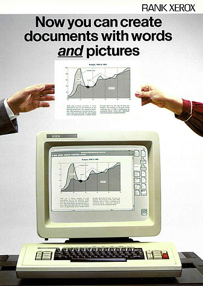
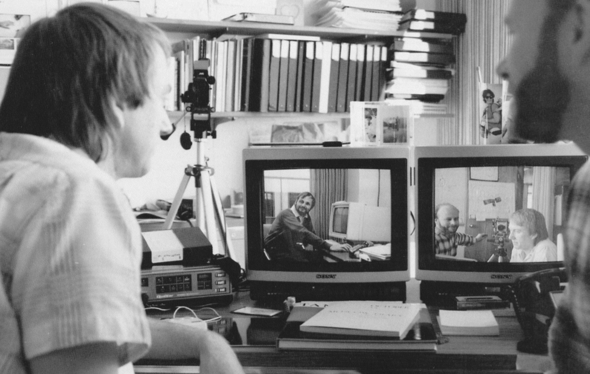

# Μοντέλα

> Το σπουδαίο έργο του Einstein είχε προέλθει από φυσική διαίσθηση και όταν ο Einstein σταμάτησε να δημιουργεί, ήταν επειδή έπαψε να σκέφτεται με συγκεκριμένες φυσικές εικόνες και έγινε χειριστής εξισώσεων.
- Freeman Dyson

Η αρχική αντίληψη που είχαν οι περισσότεροι για τη διάδραση του υπολογιστή με τον άνθρωπο είναι ότι ο υπολογιστής είναι κυρίως ένα εργαλείο. Ένα εργαλείο που δημιουργήθηκε και χρησιμοποιείται από τον άνθρωπο για να βελτιώσει τις δραστηριότητές του σε διάφορους τομείς της ζωής και κυρίως στην εργασία. Για παράδειγμα, στη διάδραση ανθρώπου-υπολογιστή μια από τις πιο δημοφιλείς εφαρμογές είναι η ψηφιακή επεξεργασία κειμένου. Στην επεξεργασία κειμένου ο ρόλος του υπολογιστή ως εργαλείο είναι η βελτίωση της εργασίας που παλιότερα γινόταν με εργαλείο τη γραφομηχανή, και ακόμη παλιότερα με την πένα. Στην πορεία όμως, η ευελιξία που έχει ο υπολογιστής στην εκτέλεση διαφορετικών προγραμμάτων χρήστη και η εφεύρεση νέων στυλ διάδρασης, πέρα από την εισαγωγή κειμένου πάνω στο πληκτρολόγιο, επέτρεψαν στη διάδραση να έχει περισσότερους ρόλους πέρα από αυτόν του εργαλείου. Επιπλέον, τα νέα μοντέλα διάδρασης δίνουν μεγαλύτερη σημασία σε αξίες πέρα από τη γνωστική επεξεργασία της πληροφορίας, όπως τα συναισθήματα, η κοινωνική διάσταση, καθώς και η συνολική παρουσία του ανθρώπινου σώματος στον χώρο.

Καθώς προχωράμε σε νέα μοντέλα διάδρασης δεν σημαίνει ότι τα προηγούμενα βασικά μοντέλα της διάδρασης χάνονται. Αντίθετα, τα βασικά μοντέλα της διάδρασης συνεχίζουν να έχουν σημαντικό ρόλο ως συστατικά στοιχεία σε πιο σύνθετα συστήματα. Για παράδειγμα, ένα σύστημα συζήτησης εξ αποστάσεως έχει ως βασικό στοιχείο του το κοινωνικό μοντέλο διάδρασης όπου ο υπολογιστής μεσολαβεί στην επικοινωνία και συνεργασία δύο ή περισσότερων ανθρώπων, αλλά μπορεί να περιέχει και το εργαλείο της ανάκτησης πληροφορίας από παλιότερες συζητήσεις. Επιπλέον, το ίδιο σύστημα μπορεί να επεκταθεί με το μοντέλο του πράκτορα διάδρασης, ο οποίος παρακολουθεί εκ μέρους του χρήστη τις συζητήσεις που γίνονται και τον ενημερώνει όταν υπάρχει κάτι που τον ενδιαφέρει ή κάνει παρεμβάσεις εκ μέρους του. Επίσης, το παραπάνω σύστημα συνεργασίας μπορεί να επεκταθεί με τη χρήση διάχυτων συσκευών διάδρασης, οι οποίες μπορούν να μεταφέρουν και τη μη λεκτική επικοινωνία. Στα επόμενα περιγράφουμε την ιστορική εξέλιξη των μοντέλων διάδρασης καθώς και τη θεωρία για καθένα ξεχωριστά, ενώ στο επόμενο κεφάλαιο θα δούμε τη σύνθεση τους.

## Ιστορικό και πολιτισμικό πλαίσιο της φιλοσοφίας της διάδρασης

Αρχικά, τόσο οι πρώτοι κεντρικοί και μικρο-υπολογιστές, όσο και ο επιτραπέζιος υπολογιστής θεωρήθηκαν ως εργαλεία που διευκόλυναν τις ανθρώπινες εργασίες. Για παράδειγμα, ο υπολογιστής μπορούσε να βοηθήσει τον χρήστη στον υπολογισμό της τροχιάς ενός διαστημοπλοίου, στην σύνταξη μιας γραπτής αναφοράς, στη σχεδίαση μιας κατασκευής, στην επεξεργασία εικόνας, κτλ. Με την διάδοση του δικτύου Internet και την αύξηση της ισχύος (ταχύτητα, μνήμη, γραφικά) σε προσιτούς οικονομικά υπολογιστές αλλά και σε νέες μορφές (π.χ., φορητός, παιχνιδομηχανή, έξυπνο κινητό τηλέφωνο, κτλ.) μια νέα γενιά εφαρμογών διασκέδασης και επικοινωνίας ήρθε στο προσκήνιο, που  απαιτούσε μια διαφορετική θεώρηση της διάδρασης, πέρα από τη χρησιμότητα και την ευχρηστία. Για παράδειγμα, ψυχαγωγικές εφαρμογές όπως τα βίντεο-παιχνίδια έχουν σκοπό να διασκεδάσουν τον χρήστη και σε πολλές περιπτώσεις ο στόχος είναι να δυσκολέψουν τον χρήστη παρά να τον διευκολύνουν, αφού αυτή η προσέγγιση (στις σωστές δόσεις) θα ενισχύσει την εμβύθιση στη ψυχαγωγική δραστηριότητα.

Ειδικά οι εφαρμογές επικοινωνίας μέσω υπολογιστή απέκτησαν μεγάλη σημασία τόσο στην εργασία (π.χ., email) όσο και στην καθημερινή ζωή και τη διασκέδαση (π.χ., forum συζητήσεων, online multiplayer games). Οι εφαρμογές επικοινωνίας και συνεργασίας μέσω υπολογιστή είναι μια μεγάλη περιοχή την οποία ερευνά το πεδίο των κοινωνικών και συνεργατικών συστημάτων. Αυτό το βήμα συνοδεύτηκε από την ανάγκη για μια νέα θεώρηση της φιλοσοφίας της διάδρασης ως μέσο επικοινωνίας. Επιπλέον, η θεώρηση της διάδρασης ως μέσο επικοινωνίας δίνει έμφαση στη συμμετοχή των χρηστών στην παραγωγή περιεχομένου και υπηρεσιών, τα οποία κατά την δεκαετία του 2000 έγιναν ο κυρίαρχος τρόπος διάδρασης με τους υπολογιστές, ειδικά στο διαδίκτυο. Η σημασία των υπολογιστών ως μέσο επικοινωνίας γίνεται ακόμη πιο εμφανής κατά τη δεκαετία του 2010, όταν το κοινωνικό δίκτυο Facebook καθώς και τα έξυπνα κινητά τηλέφωνα γίνονται το πρώτο -και πολλές φορές το μόνο- σημείο επαφής των περισσότερων χρηστών με τους υπολογιστές.

Καθώς η χρήση του υπολογιστή ξέφυγε από το στενό πλαίσιο της εργασίας και την αντίληψη του ως απλό εργαλείο -όπου η απαίτηση για χρησιμότητα και ευχρηστία είναι κυρίαρχη- δημιουργήθηκε η ανάγκη για ένα νέο αξιακό σύστημα που να βασίζεται περισσότερο στα συναισθήματα του ανθρώπου, και να εμπλέκει πιο πολλές ανθρώπινες αισθήσεις. Τόσο οι ερευνητικές μελέτες όσο και τα εμπορικά προϊόντα προς το τέλος της δεκαετίας του 2000 άρχισαν να δίνουν έμφαση όχι μόνο στη γνωστική επεξεργασία της πληροφορίας αλλά και στα συναισθήματα του ανθρώπου, και αντίστοιχα η περιοχή της σχεδίασης της διάδρασης ανθρώπου-υπολογιστή αρχίζει να περιγράφεται και ως σχεδίαση της εμπειρίας του χρήστη. Με αυτόν τον τρόπο γίνεται ένα ακόμη βήμα μακρύτερα από την αρχική θεώρηση της περιοχής της διάδρασης που ήταν γνωστή ως σχεδίαση της διεπαφής ανθρώπου-υπολογιστή, όπου η διάδραση γινόταν, για παράδειγμα, αντιληπτή ως η σχεδίαση των παραθύρων και των εικονιδίων της γραφικής επιφάνειας εργασίας.

Επιπλέον, με την ανάπτυξη του κινητού και διάχυτου υπολογισμού, στις αρχές της δεκαετίας του 2000, η διάδραση έκανε το μεγάλο βήμα πέρα από το πλαίσιο της εργασίας και του γραφείου. Ειδικά για την περίπτωση του διάχυτου υπολογισμού, όπου έχουμε πολλούς υπολογιστές διαφόρων μορφών φορετών στον χρήστη ή διάχυτων στο περιβάλλον, η νέα θεώρηση της διάδρασης βασίστηκε στις φιλοσοφικές θεωρίες για την ενσάρκωση (embodiment), οι οποίες περιγράφουν την ανθρώπινη σκέψη, την αντίληψη και τη δράση ως έννοιες στενά δεμένες με την ύπαρξη και τις ιδιότητες του ανθρώπινου σώματος. Οι υπολογιστές, πλέον, εκτός από την κινητή μορφή τους, μπορούν να φορεθούν και καταγράφουν βιομετρικά στοιχεία του χρήστη τους, όπως κινήσεις και σφυγμό. Παράλληλα με την σταδιακή έμφαση στην συνολική φύση του ανθρώπου, μια μεγάλη μερίδα του επιστημονικού και εμπορικού κόσμου συνεχίζει να αναζητεί τη χρησιμότητα του υπολογιστή στον αυτοματισμό, όπου η διάδραση γίνεται αντιληπτή ως επικοινωνία με έναν έξυπνο βοηθό.

## Ο Υπολογιστής ως Εργαλείο

Οι άνθρωποι έμαθαν από τα πρώτα στάδια του επιτραπέζιου υπολογιστή (δεκαετία του '80) να τον βλέπουν ως εργαλείο και αυτή η αντίληψη παραμένει ισχυρή και σήμερα κατά τη χρήση του σε εργασιακά περιβάλλοντα. Ως εξελιγμένο εργαλείο, ο ΗΥ με επεξεργαστή κειμένου επιτρέπει στον χρήστη να προετοιμάσει ένα κείμενο σε ψηφιακή μορφή, η οποία είναι πιο ευέλικτη στις αλλαγές, στην αποθήκευση και στη μεταφορά από ότι μια φυσική σελίδα που τυπώνεται  στην παραδοσιακή γραφομηχανή ή που γράφεται με ένα μολύβι. Φυσικά υπάρχουν και σύνθετες περιπτώσεις, όπου πολλά εργαλεία συμπληρώνουν το ένα το άλλο, για να επιτελέσουν μια πολύπλοκη δραστηριότητα. Για παράδειγμα, ο προγραμματισμός υπολογιστών βασίζεται συνήθως στη χρήση ενός απλού επεξεργαστή κειμένου και μιας σειράς από βοηθητικά προγράμματα υπολογιστή που υποστηρίζουν την προετοιμασία, τον έλεγχο και την τελική εκτέλεση του νέου προγράμματος. Ο προγραμματιστής του υπολογιστή αντιλαμβάνεται και χρησιμοποιεί τα παραπάνω ως εργαλεία για να κάνει την δουλειά του, που είναι η κατασκευή ή η επισκευή ενός προγράμματος στον υπολογιστή.

Η πρωταρχική και για πολλά χρόνια κυρίαρχη αντίληψη του υπολογιστή ως εργαλείου μπορεί να εντοπιστεί στα πρώτα στάδια της δημιουργίας και εξέλιξης της γραφικής επιτραπέζιας επιφάνειας εργασίας από την ερευνητική ομάδα του Xerox PARC. Η ανθρωποκεντρική μελέτη των διεργασιών του χρήστη βασίστηκε στην παρατήρηση, στις συνεντεύξεις, και στην ανάλυση της εργασίας που πραγματοποιείται στους εκδοτικούς οργανισμούς, οι οποίοι ήταν οι βασικοί πελάτες της εταιρείας Xerox κατά την δεκαετία του 1970. Οι διεργασίες που εκτελεί αυτή η πολύ καλά ορισμένη ομάδα χρηστών (π.χ., γλωσσική επιμέλεια, γραφικά, σελιδοποίηση, διαχείριση της παραγωγής του εντύπου) αποτέλεσαν το σημείο αναφοράς για τον προγραμματισμό της διάδρασης, ο οποίος οργανώθηκε πάνω στη γραφική επιφάνεια εργασίας (π.χ., φάκελοι, εργαλεία, καλάθι αχρήστων, κτλ.), ως βασική μεταφορά της εργασίας που κάνουν οι χρήστες. Αν και η επιφάνεια εργασίας αποδείχθηκε στην πορεία εξαιρετικά ευέλικτη και προσαρμόσιμη στις τεχνολογικές εξελίξεις, ταυτόχρονα αυτό το αρχικό πλαίσιο δημιουργίας της ως εργαλείο για εκδοτικές εργασίες παρέμεινε βασικός περιορισμός που δημιουργεί την ανάγκη για μια διαφορετική αντίληψη του προγραμματισμού της διάδρασης, τουλάχιστον σε διαφορετικά πλαίσια ανθρώπινης δραστηριότητας (π.χ., ψυχαγωγία).

Εκτός από τις διεργασίες της προετοιμασίας και της σελιδοποίησης μιας γραπτής αναφοράς, που γίνονται τόσο από ερασιτέχνες όσο και από επαγγελματίες χρήστες ΗΥ, μια ακόμη δημοφιλής εφαρμογή της διάδρασης είναι η διαδικασία της σχεδίασης που εφαρμόζουν οι μηχανικοί. Από τις αρχές της δεκαετίας του 1980 όλες οι κατηγορίες μηχανικών άρχισαν να χρησιμοποιούν τον υπολογιστή αντί του σχεδιαστηρίου για να ετοιμάσουν κτήρια, δρόμους, γέφυρες, αεροσκάφη, μηχανές, αντικείμενα, και ηλεκτρικά κυκλώματα. Στην πράξη, η σχεδίαση με υπολογιστή είναι πολύ πιο αποδοτική, ειδικά για τη σχεδίαση αντικειμένων που είναι παρόμοια με άλλα υπάρχοντα ή μοιράζονται κάποια κοινά μοτίβα. Επιπλέον, το βασικό πλεονέκτημα είναι ότι η χρήση ΗΥ επιτρέπει τη γρήγορη αναίρεση μιας αλλαγής και την ασφαλή εξερεύνηση εναλλακτικών κατευθύνσεων. Επίσης, ένα ακόμη πλεονέκτημα της διαδραστικής σχεδίασης είναι ότι επιτρέπει την εύκολη αποθήκευση και τον διαμοιρασμό, στοιχεία απαραίτητα στις περισσότερες συνεργατικές δραστηριότητες σχεδίασης. Από την άλλη πλευρά, από την στιγμή που η διαδραστική σχεδίαση λειτουργεί μόνο στο στενό και καλά ορισμένο πλαίσιο ενός προγράμματος διάδρασης στον υπολογιστή, δυσκολεύει τη σχεδίαση αντικειμένων που δεν έχουν υπάρξει ακόμη.  Ως προς τον αυτοσχεδιασμό και τη φαντασία, η διαδραστική σχεδίαση είναι ακόμα ένα περιοριστικό εργαλείο, αν τη συγκρίνει κανείς με το μολύβι και το χαρτί στα χέρια ενός έμπειρου χρήστη.

Η εμπορική σημασία του υπολογιστή ως εργαλείο φαίνεται στην περίπτωση του ηλεκτρονικού εμπορίου, που σε πολύ σύντομο χρονικό διάστημα άλλαξε τον τρόπο πώλησης και διανομής πολλών κατηγοριών τυποποιημένων προϊόντων και κυρίως υπηρεσιών. Η πανάρχαια συνήθεια της μετάβασης στην αγορά για την προμήθεια προϊόντων και υπηρεσιών μετασχηματίζεται σε μια διαδραστική εμπειρία στον υπολογιστή. Ο υπολογιστής ως εργαλείο επιλογής προϊόντων και ως εργαλείο πληρωμής μειώνει τη σημασία του τυπωμένου χρήματος καθώς η συναλλαγή πραγματοποιείται λογιστικά ανάμεσα στους λογαριασμούς του προμηθευτή και του πελάτη.

Η προτίμηση που δείχνουν οι χρήστες διαδραστικών συστημάτων στην ηλεκτρονική μορφή αγοράς και χρηματικής συναλλαγής δημιουργεί μια σειρά από πρωτοφανείς επιπτώσεις. Ειδικά στην περίπτωση της παροχής υπηρεσιών χωρίς τη μεταβίβαση κάποιου απτού προϊόντος (π.χ., αγορά αεροπορικών εισιτηρίων, κράτηση σε ξενοδοχείο, ψηφιακό ψυχαγωγικό περιεχόμενο, όπως μουσική, ταινίες, παιχνίδια),  το ηλεκτρονικό εμπόριο αποδείχτηκε πιο αποτελεσματικό από το φυσικό τόσο για τους χρήστες όσο και για τους πάροχους της υπηρεσίας. Στις περιπτώσεις όπου η μετάβαση στο ηλεκτρονικό εμπόριο υπήρξε καθολική είχε ως αποτέλεσμα την καταστροφή πολλών επιμέρους ενδιάμεσων (π.χ., δισκοπωλεία, τουριστικοί πράκτορες, κ.ά.). Επομένως, βλέπουμε ότι η χρήση του υπολογιστή ως εργαλείο μπορεί να είναι μια απλή βελτιστοποίηση μιας διεργασίας που ήδη κάνουμε (π.χ., συγγραφή κειμένου), αλλά μπορεί και να έχει σημαντικές επιπτώσεις σε επαγγέλματα και ανθρώπινες δραστηριότητες που παύουν να υπάρχουν επειδή δε χρειάζονται πλέον, αφού γίνονται πολύ πιο αποτελεσματικά με τον προγραμματισμό της διάδρασης ανθρώπου-υπολογιστή (π.χ., αγορά αεροπορικού εισιτηρίου).

Η αντίληψη του υπολογιστή ως εργαλείο παραμένει κυρίαρχη και στην εποχή της μετάβασης από τον επιτραπέζιο στον κινητό και διάχυτο υπολογισμό. Για παράδειγμα, ένα έξυπνο κινητό τηλέφωνο συνοδεύεται συνήθως από μια ψηφιακή φωτογραφική μηχανή, δηλαδή από ένα εργαλείο αποτύπωσης εικόνων. Οι ψηφιακές φωτογραφικές μηχανές των έξυπνων κινητών τηλεφώνων επικράτησαν γιατί εκτός από την οικειότητα που έχουμε αναπτύξει στη χρήση των βασικών λειτουργιών των έξυπνων κινητών και την ευχέρεια του να τα έχουμε πάντα μαζί μας, παρέχουν μια σειρά από επιπλέον λειτουργίες χάρη στις δυνατότητες του έξυπνου κινητού τηλεφώνου (π.χ., αισθητήρας θέσης, κίνησης, φίλτρα, δικτύωση, κτλ.). Αυτές οι δυνατότητες κάνουν την ενσωματωμένη φωτογραφική μηχανή ακόμη πιο χρήσιμη και εύχρηστη (π.χ., για τη δημιουργία πανοραμικής φωτογραφίας). Παρομοίως με τα κινητά τηλέφωνα που έχουν και φωτογραφική μηχανή, φορετοί υπολογιστές όπως τα έξυπνα ρολόγια που περιέχουν αισθητήρες κίνησης και βιομετρικών στοιχείων  μετατρέπουν ένα εργαλείο που έδινε ρυθμό με βάση τον κοινώς αποδεκτό χρόνο της Γης, σε εργαλείο που μετράει περισσότερες παραμέτρους (π.χ., ώρες ύπνου, βήματα, κτλ.) και μπορεί να δώσει ρυθμό με βάση το αξιακό σύστημα του κάθε ανθρώπου χωριστά. Συμπερασματικά, η αντίληψη του υπολογιστή ως εργαλείο παραμένει δημοφιλής (ίσως περισσότερο από ποτέ), καθώς η χρήση του διαχέεται σε όλο και πιο πολλές ανθρώπινες δραστηριότητες. Ταυτόχρονα, ο υπολογιστής αποκτά νέους ρόλους. Πέρα από εργαλείο, γίνεται και μέσο επικοινωνίας, και αυτός ο ρόλος του ίσως από την πλευρά του ανθρώπου να είναι και πιο σημαντικός.

## Ο Υπολογιστής ως Μέσο Επικοινωνίας

Οι καλλιτέχνες ήταν από τους πρώτους που χρησιμοποίησαν τον υπολογιστή ως εργαλείο για να δημιουργήσουν. Όμως η πιο σημαντική συνεισφορά τους στην εξέλιξη της χρήσης του υπολογιστή ήταν ότι τον χρησιμοποίησαν ως μέσο για το έργο τους. Για παράδειγμα, η Brenda Laurel με υπόβαθρο στις θεατρικές σπουδές αναγνωρίζει τη δυνατότητα των υπολογιστών να λειτουργούν ως σκηνή όπου οι χρήστες μπορούν να παίζουν ρόλους και να αυτοσχεδιάζουν. Αυτή η αντίληψη έρχεται να συμπληρώσει την αντίληψη του υπολογιστή ως εργαλείο που σχεδιάζεται με στόχο να ικανοποιήσει καλά ορισμένες ανθρώπινες ανάγκες και δραστηριότητες. Επίσης, ο Myron Kruger προγραμμάτισε για πρώτη φορά, στα μέσα της δεκαετίας του 1970, τη διάδραση ανθρώπου-υπολογιστή με έμφαση στην παρουσία του ανθρώπινου σώματος. Με αυτόν τον τρόπο η κατανόηση της διάδρασης με τον υπολογιστή απελευθερώνεται από τη μέχρι τότε αντίληψη της ως εργαλείο και αρχίζει να γίνεται αντιληπτή και ως μέσο επικοινωνίας που συνδέει τους ανθρώπους μεταξύ τους και με την πληροφορία που μπορούμε να αναπαραστήσουμε στον υπολογιστή.

Η αρχική αντίληψη που έχουν οι περισσότεροι άνθρωποι για τη διάδραση -και η οποία στην συνέχεια καθορίζει έμμεσα μια σειρά από άλλες αντιλήψεις και σχεδιαστικές επιλογές- είναι αυτή της 'ένας-προς-έναν' επικοινωνίας ανάμεσα σε άνθρωπο και υπολογιστή. Αν και η 'ένας-προς-έναν' διάδραση ανθρώπου-υπολογιστή αποτελεί βασικό συστατικό κάθε σύνθετης μορφής διάδρασης, δε βρίσκεται πάντα στο επίκεντρο του ενδιαφέροντος. Στον επιτραπέζιο υπολογιστή, όπου έχουμε ένα πληκτρολόγιο και ένα ποντίκι, η διάδραση ανάμεσα στον άνθρωπο και τον υπολογιστή είναι 'ένας-προς-έναν'. Σε αυτό το πλαίσιο έχει δημιουργηθεί και έχει ωριμάσει η περιοχή της διάδρασης ανθρώπου-υπολογιστή. Καθώς, όμως, οι υπολογιστές άρχισαν να δικτυώνονται, (είτε στον ίδιο χώρο είτε σε μεγάλες γεωγραφικές αποστάσεις και διαφορετικές χρονικές ζώνες), δημιουργήθηκε η ανάγκη να μελετήσουμε και να προγραμματίσουμε τη διάδραση που συμβαίνει ανάμεσα σε ανθρώπους που συνεργάζονται από απόσταση και σε διάφορους τομείς, όπως στην εργασία, τη διασκέδαση, τη εκπαίδευση, και την καθημερινή ζωή.

Τα Συνεργατικά Συστήματα έγιναν γνωστά ως επιστημονική περιοχή στα τέλη της δεκαετίας του 1980, αλλά η συνεργασία και η επικοινωνία μέσω υπολογιστή είχε ήδη ξεκινήσει. Στα τέλη της δεκαετίας του 1970 η μεγάλη διάδοση των πρώτων οικονομικών προσωπικών υπολογιστών και των μόντεμ που επέτρεπαν την ψηφιακή μετάδοση δεδομένων μέσα από τις αναλογικές τηλεφωνικές γραμμές, δημιούργησε τα πρώτα Bulletin Board Systems (BBS). Τα BBS ήταν ένα είδος φόρουμ (forum), όπου οι χρήστες μπορούσαν να  έχουν μια σύγχρονη ή ασύγχρονη συζήτηση, να αναρτήσουν ανακοινώσεις, και να μοιραστούν αρχεία. Την ίδια περίοδο, αντίστοιχα συστήματα συνεργατικού λογισμικού, βασισμένα σε μικρο-υπολογιστές (micro-computers) και κεντρικούς υπολογιστές (mainframe computers), αναπτύχθηκαν για εταιρείες με σκοπό τη διευκόλυνση της επαγγελματικής συνεργασίας.

Η ερευνητική περιοχή της Συνεργασίας Ανθρώπων μέσω Υπολογιστών θεωρείται η πρώτη (και ίσως η πιο σημαντική) συγγενής περιοχή της Διάδρασης Ανθρώπου-Υπολογιστή. Επομένως, ένα μεγάλο μέρος της θεωρίας, των μεθόδων και των τεχνικών που χρησιμοποιούν είναι κοινές ή τουλάχιστον παρόμοιες. Υπάρχει, όμως, τουλάχιστον μια σημαντική διαφορά που επιβάλλει την αντιμετώπιση των Κοινωνικών και Συνεργατικών Συστημάτων ως ξεχωριστή περιοχή. Ενώ στη διάδραση ανθρώπου-υπολογιστή εστιάζουμε συνήθως την προσοχή μας (κατά τον προγραμματισμό και την αξιολόγηση του συστήματος) στη διάδραση ανάμεσα σε έναν άνθρωπο και έναν υπολογιστή· στα Κοινωνικά και Συνεργατικά Συστήματα η βασική μονάδα ανάλυσης είναι η διάδραση ανάμεσα σε μια ομάδα (τουλάχιστον δύο) ανθρώπων, που συμβαίνει μέσω ενός τουλάχιστον υπολογιστή. Το πιο απλό και δημοφιλές παράδειγμα για την περιοχή των Συνεργατικών Συστημάτων είναι το Facebook, ένα σύστημα που επιτρέπει την επικοινωνία και τη συνεργασία ομάδων ανθρώπων.

Η σημασία των κοινωνικών και συνεργατικών συστημάτων πέρασε από τις εταιρείες στην ευρύτερη κοινωνία και από την εργασία στην καθημερινότητα με την ανάπτυξη των κοινωνικών δικτύων μετά τα μισά της δεκαετίας του 2000. Εκείνη την περίοδο δημιουργήθηκαν πολλά κοινωνικά δίκτυα, όπου ο κάθε χρήστης περιέγραφε την προσωπικότητα και τις προτιμήσεις του και έκανε εικονικούς δεσμούς φιλίας με άλλους χρήστες. Ανάμεσα στα πολλά κοινωνικά δίκτυα, το Facebook ήταν εκείνο που γνώρισε τη μεγαλύτερη αποδοχή, με περισσότερο από ένα δισεκατομμύριο εγγεγραμμένους χρήστες στις αρχές της δεκαετίας του 2010. Οι βασικές δραστηριότητες των χρηστών του Facebook είναι η ενημέρωση της τρέχουσας κατάστασής τους, η δημόσια ή ιδιωτική συζήτηση, και η ανάρτηση φωτογραφιών. Καθώς ο κύριος όγκος της δραστηριότητας στο διαδίκτυο μετατοπίστηκε από την υπηρεσία του ιστού και την ανάρτηση ιστοσελίδων στα δίκτυα κοινωνικής δικτύωσης, αντίστοιχα παρατηρούμε και μια μεταβολή στο είδος της διάδρασης των νέων εφαρμογών, οι οποίες επιβάλλεται να έχουν πλέον και μια κοινωνική διάσταση.

## Ο Υπολογιστής ως Εταίρος

Η αντίληψη του υπολογιστή ως μια έξυπνη και αυτόνομη οντότητα εμφανίστηκε για πρώτη φορά στη λογοτεχνία και τις ταινίες επιστημονικής φαντασίας όπου οι δημιουργοί φαντάζονταν έναν υπολογιστή με ανθρώπινα στοιχεία διάδρασης. Αυτός ο ανθρωπομορφισμός της διάδρασης ανθρώπου-υπολογιστή μπορεί να πάρει διάφορες μορφές ή χαρακτηριστικά που συνδέουμε με την ανθρώπινη παρουσία, όπως πρόσωπο, ομιλία, σώμα, συναίσθημα, κοινή λογική. Η περιοχή της Τεχνητής Νοημοσύνης προσπάθησε να δώσει πρακτικές λύσεις στα παραπάνω αλλά τα αποτελέσματά της έχουν μόνο περιορισμένη χρησιμότητα και σε πολύ καλά ορισμένες εφαρμογές. Για παράδειγμα, η αναγνώριση γραφής και ομιλίας είναι πλέον εμπορικά διαθέσιμες, ύστερα από περισσότερα από σαράντα χρόνια έρευνας και αποτυχημένων εμπορικών προϊόντων. Στην πράξη, όμως, δεν είναι όσο χρήσιμη τη φαντάστηκαν οι δημιουργοί της επιστημονικής φαντασίας, ούτε τόσο πρακτική όσο τη σχεδίασαν οι επιστήμονες της Τεχνητής Νοημοσύνης, αφού στις περισσότερες περιπτώσεις η διάδραση γίνεται με συσκευές εισόδου και επιπλέον διεπαφές που πρέπει να μάθει να χρησιμοποιεί ο χρήστης.

Ο αυτοματισμός είναι μια εκδοχή της διάδρασης ανθρώπου-υπολογιστή όπου οι ενέργειες του χρήστη, η διεπαφή του υπολογιστή ή ακόμη και οι ανάγκες του χρήστη εξάγονται δυναμικά από τον υπολογιστή, ο οποίος μπορεί επιπλέον να λαμβάνει αποφάσεις με βάση ορισμένους κανόνες. Ο αυτοματισμός που προσφέρει ένας υπολογιστής μπορεί να διευκολύνει και τη διάδραση με τον άνθρωπο. Για παράδειγμα, μια λίστα με εφαρμογές μπορεί να ταξινομηθεί ανάλογα με το ποιες χρησιμοποιούμε συχνότερα. Φυσικά, αυτό σημαίνει ότι το αντίστοιχο μενού θα είναι πιθανόν διαφορετικό κάθε φορά που το ζητάει ο χρήστης, πράγμα που ίσως δημιουργεί, εκτός από διευκόλυνση, και μια ασυνέπεια απέναντι στη συνήθεια του να βρίσκουμε τα πράγματα εκεί που τα αφήσαμε. Αν και ο αυτοματισμός έχει αποδειχτεί πολύ χρήσιμος σε πολλές εφαρμογές των υπολογιστών, στην περίπτωση της διάδρασης η χρήση του αυτοματισμού θέλει προσοχή, κυρίως γιατί θα πρέπει να αξιολογηθεί απέναντι στον χρήστη και όχι μόνο απέναντι σε κάποιες λειτουργικές και φαινομενικά αντικειμενικές προδιαγραφές.

Παράλληλα με τους ερευνητές της Τεχνητής Νοημοσύνης που προσπαθούν να κωδικοποιήσουν την ανθρώπινη λογική και συμπεριφορά σε έναν υπολογιστή, οι ερευνητές της Ανθρώπινης Επικοινωνίας διαπιστώνουν ότι στην πράξη οι ανθρώπινες αντιδράσεις κατά την διάδραση με υπολογιστές και μέσα επικοινωνίας δεν έχουν διαφορά από τις αντιδράσεις κατά την διάδραση με άλλους ανθρώπους και φυσικά αντικείμενα. Η διαπίστωση αυτή δημιούργησε μια σειρά από ερευνητικές και εμπορικές απόπειρες στην κατεύθυνση του ανθρωπομορφισμού (anthropomorphism) και του σκευομορφισμού (skeuomorphism) κατά τον προγραμματισμό της διάδρασης. Το αρχικό κίνητρο σε όλες αυτές τις προσπάθειες είναι η δημιουργία μιας περισσότερο οικείας και "φιλικής" διάδρασης με τον άνθρωπο. Στην πορεία, η "φιλική διεπαφή" της δεκαετίας του 1990 έδωσε την θέση της στην "πειστική διεπαφή" της δεκαετίας του 2000, όταν οι σχεδιαστές προσπάθησαν να δημιουργήσουν διεπαφές που θα βοηθούσαν τους χρήστες να αλλάξουν συμπεριφορά. Για παράδειγμα, μια εφαρμογή που καταγράφει τα βήματα και την απόσταση που διανύουμε καθημερινά με τα πόδια, μπορεί να περιέχει τη στατιστική αποτύπωση των επιδόσεών μας και επιπλέον μια ανθρωπόμορφη διεπαφή που να μας παροτρύνει ή ακόμη και να μας επικρίνει (ανάλογα με το ψυχολογικό προφίλ του χρήστη) για τις επιδόσεις μας, έτσι ακριβώς όπως θα έκανε ένας φίλος ή ένας προσωπικός γυμναστής.

Ίσως μία από τις πιο αποτυχημένες εισαγωγές νέου προϊόντος διάδρασης ανθρώπου-υπολογιστή να ήταν η προσπάθεια της Microsoft να δώσει μια πιο "φιλική" διάδραση στις εφαρμογές της με το Microsoft Bob, και το σχετικό Microsoft Office Clip. Αν και η ιδέα του ανθρωπομορφισμού βασιζόταν ήδη σε πολυετή επιστημονική έρευνα και παρά το ότι είχαν γίνει πολλές δοκιμές με χρήστες στα αρχικά στάδια του προϊόντος, τελικά η αποδοχή από το ευρύ κοινό ήταν από μικρή έως αρνητική.

Εκ των υστέρων, μια πιθανή εξήγηση αυτής της έλλειψης αποδοχής είναι ότι τουλάχιστον στη δεκαετία του 1990 οι περισσότεροι επιτραπέζιοι υπολογιστές χρησιμοποιούνταν ακόμη κυρίως στην εργασία και γι' αυτό η έννοια της "φιλικότητας" μέσω του ανθρωπομορφισμού δεν είχε μεγάλη σημασία για τους χρήστες τους. Μπορεί να τους φαινόταν ακόμη και ενοχλητική καθώς προσπαθούσαν να συγκεντρωθούν για να εργαστούν στον επεξεργαστή κειμένου και ξαφνικά, στην οθόνη του τερματικού τους, τους έπιανε κουβέντα ένας σκύλος! Με μια δεύτερη ανάγνωση, η ιστορία του Microsoft Bob είναι και μία προειδοποίηση ότι οι τεχνικές της ανθρωποκεντρικής σχεδίασης δεν είναι ασφαλείς, όχι επειδή είναι λάθος τεχνικές, αλλά κυρίως επειδή έχουν ως στόχο να ικανοποιήσουν ανθρώπινες ανάγκες που είναι από ασαφείς μέχρι ρευστές.

Οι έξυπνοι πράκτορες είναι μια αυτοματοποιημένη εκδοχή της διάδρασης με τον υπολογιστή. Ένας τρόπος να οριστούν οι έξυπνοι πράκτορες είναι ως το συμπλήρωμα του απευθείας χειρισμού. Όπως δηλαδή έχουμε τον απευθείας χειρισμό για να εκτελέσουμε μια διεργασία στον υπολογιστή, έτσι έχουμε και τους έξυπνους πράκτορες που μπορούν να εκτελέσουν αυτήν τη διεργασία για λογαριασμό μας. Από τη μια πλευρά ο απευθείας χειρισμός δίνει στον χρήστη τη δυνατότητα πάρει αποφάσεις, αλλά από την άλλη πλευρά υπάρχει ένα όριο στην πληροφορία που μπορεί να επεξεργαστεί ο χρήστης. Επιπλέον, σίγουρα υπάρχουν πολλές αποφάσεις που ως παρόμοιες ή τουλάχιστον έχοντας κάποιες ιδιότητες που είναι παρόμοιες, θα μπορούσαν να λαμβάνονται από έναν έξυπνο πράκτορα που να εκπροσωπεί τον χρήστη. Αν και σε πρώτη ανάγνωση φαίνεται ότι οι έξυπνοι πράκτορες είναι το αντίθετο του απευθείας χειρισμού, εντούτοις είναι περισσότερο γόνιμο να τα αντιμετωπίζουμε ως συμπληρωματικά. Για παράδειγμα ο χρήστης με απευθείας χειρισμό δείχνει στον υπολογιστή ότι κάποια από τα ηλεκτρονικά μηνύματα του είναι άχρηστα ενώ άλλα είναι χρήσιμα για την εργασία του, έτσι ο έξυπνος πράκτορας την επόμενη φορά που θα δει ένα μήνυμα θα μπορέσει να το μεταφέρει στον σωστό φάκελο χωρίς επιπλέον ενέργειες από την πλευρά του χρήστη. Στην πράξη αυτά τα συστήματα έχουν βελτιωθεί πάρα πολύ και στις περισσότερες περιπτώσεις κάνουν λιγότερα λάθη από τον άνθρωπο, όμως σε κάθε περίπτωση για όποια λάθη κάνουν δεν φέρουν ευθύνη, κι αυτό μπορεί να είναι σημαντικό σε κάποιες εφαρμογές.

Όταν η μεταφορά γίνεται ιδιαίτερα αναπαραστατική σε ένα γραφικό περιβάλλον τότε  μιλάμε για σκευομορφισμό, όπως για παράδειγμα πολλές εφαρμογές στις πρώτες εκδόσεις του iPhone οι οποίες μοιάζουν με αντικείμενα (π.χ., μικρόφωνο για την εγγραφή ηχητικών σημειώσεων) ή προσομοιώνουν οπτικά την υφή υλικών, όπως π.χ., μέταλλο, ύφασμα, κτλ. Αν και το αρχικό iPhone (iOS) ήταν από τις πιο δημοφιλείς συσκευές με τεχνικές σκευομορφισμού στην έξοδο προς τον χρήστη, σίγουρα δεν ήταν η πρώτη. Στην δεκαετία του 1990, η σταδιακή μετατροπή και διανομή της μουσικής με συμπιεσμένα αρχεία τύπου MP3 δημιούργησε την ανάγκη για ευέλικτες εφαρμογές εκτέλεσης των αρχείων MP3 στον υπολογιστή και ανάμεσα σε αυτές οι πιο δημοφιλείς ήταν εκείνες που επέτρεπαν στον χρήστη να αλλάξει την εμφάνιση της εφαρμογής (skinning), με πιο αντιπροσωπευτικό παράδειγμα την εφαρμογή Winamp. Η χρήση της μεταφοράς και του σκευομορφισμού δεν έχει από μόνη της πάντα θετικά αποτελέσματα. Για παράδειγμα, στις αρχές της δεκαετίας του 1990 το λειτουργικό σύστημα Magic Cap για τον κινητό υπολογισμό εμφάνιζε στην οθόνη ένα γραφείο με οικεία αντικείμενα, όπως το τηλέφωνο-φαξ, το ημερολόγιο, το σημειωματάριο, η λίστα επαφών, τα εισερχόμενα/εξερχόμενα, το αρχείο, κτλ. Η χρήση της μεταφοράς στην περίπτωση του Magic Cap δεν σταματούσε στο γραφείο, αλλά συνεχιζόταν με τη μετακίνηση του χρήστη σε δωμάτια από τα οποία είχε πρόσβαση σε διαφορετικές λειτουργίες. Αν και είναι δύσκολο, έως αδύνατο, να διακρίνουμε τα προβλήματα, καμία από τις παραπάνω μορφές της διεπαφής με τον χρήστη δεν είχε την αποδοχή των χρηστών, παρόλο που εφάρμοζαν κάποιους από τους κανόνες της "φιλικής" για τον άνθρωπο σχεδίασης, όπως είναι η μεταφορά και ο σκευομορφισμός.

## Ερευνητική Μελέτη Περίπτωσης

Η αρχική θεωρητική θεμελίωση της περιοχής της διάδρασης ανθρώπου-υπολογιστή βασίστηκε στην τρέχουσα για την εποχή αντίληψη της διάδρασης, που με την σειρά της βασιζόταν στον επιτραπέζιο υπολογιστή, στην γραφική επιφάνεια εργασίας, και στο πλαίσιο των εφαρμογών γραφείου και παραγωγικότητας. Αντίστοιχα, η αρχική θεώρηση της διάδρασης έδωσε έμφαση στην επεξεργασία της πληροφορίας από τον άνθρωπο, καθώς και στον έλεγχο και την απεικόνιση της πληροφορίας στο τερματικό του χρήστη. Οι θεμελιωτές της αρχικής θεωρίας προσπάθησαν να δημιουργήσουν ένα αναλυτικό πλαίσιο και τα αντίστοιχα μοντέλα, που να εκφράζουν τον τρόπο που ο άνθρωπος αντιλαμβάνεται, επεξεργάζεται, και ελέγχει την πληροφορία. Σε ορισμένες περιπτώσεις,όπως στην πρόβλεψη της απόδοσης της συσκευής εισόδου 'ποντίκι', η αναλυτική αυτή προσέγγιση είχε άριστα και διαχρονικά αποτελέσματα.

Από την άλλη πλευρά όμως, καθώς περάσαμε στον κινητό και διάχυτο υπολογιστή, και καθώς οι υπολογιστές έγιναν μέρος δραστηριοτήτων με αξίες πέρα από την παραγωγικότητα, η ποιότητα της διάδρασης άρχισε να αποκτά και άλλες διαστάσεις πέρα από εκείνη της βασικής ευχρηστίας. Στα τέλη της δεκαετίας του 1990, μια σειρά από πειράματα διάδρασης με διεπαφές που είχαν μεταξύ τους διαφορές μόνο στην αισθητική -και όχι στην ευχρηστία τους- οδήγησε στο συμπέρασμα ότι η ευχρηστία δεν είναι ο μόνος παράγοντας που καθορίζει την αποδοχή μιας διεπαφής. Τα πειράματα έγιναν με πολλές διαφορετικές διεπαφές, με τραπεζικά ATM, μουσικές συσκευές, συστήματα προσομοίωσης βιομηχανικών διαδικασιών, και με ηλεκτρονικά καταστήματα, έτσι ώστε να εξεταστεί η έκταση του φαινομένου. Διαπιστώθηκε, μάλιστα, ότι οι χρήστες θεωρούσαν περισσότερο εύχρηστες τις διεπαφές που είχαν καλύτερη αισθητική.

Για να μελετήσουν την επίδραση της αισθητικής μιας διεπαφής στην αντίληψη του χρήστη για την ευχρηστία ενός συστήματος, οι ερευνητές προχώρησαν στην εκτέλεση ενός πειράματος. Ο σχεδιασμός του πειράματος περιλάμβανε ότι διαφορετικές ομάδες χρηστών θα αξιολογούσαν τόσο ως εμφάνιση και ευχρηστία αλλά και ως συμπεριφορά, διαφορετικά επίπεδα αισθητικής και ευχρηστίας μιας βασικής διεπαφής μηχανήματος από Αυτόματη Ταμειακή Μηχανή (ΑΤΜ) τράπεζας.

Για τον σκοπό αυτό οι ερευνητές κατασκεύσαν μια προσομοίωση του ΑΤΜ για διαφορετικές εκδοχές διαρρύθμισης των κουμπιών, και ζήτησαν από τους χρήστες να τα βαθμολογήσουν αναφορικά με την αισθητική και την ευχρηστία τους. Αμέσως μετά τους ζήτησαν να εκτελέσουν μια σειρά από τυπικές διεργασίες (π.χ., ανάληψη χρημάτων, ερώτηση υπολοίπου λογαριασμού) με τα οποία βαθμολόγησαν τις εναλλακτικές διεπαφές. Με αυτόν τον τρόπο η ανάλυση των αποτελεσμάτων έδωσε την συσχέτιση ανάμεσα στην αισθητική και την ευχρηστία που υπήρχε στα ΑΤΜ. Εκτός από την παραπάνω μεθοδολογία του πειράματος, ιδιαίτερο ενδιαφέρον παρουσιάζει επίσης η χρήση του λογισμικού διάδρασης το οποίο προσομοίωνε τα ΑΤΜ, αφού όπως είδαμε στο κεφάλαιο τρία αντίστοιχο λογισμικό χρησιμοποιήθηκε και για την κατασκευή εναλλακτικών συσκευών εισόδου 'ποντίκι'.

Τα αποτελέσματα σε αυτό το επιστημονικό άρθρο ήρθαν να συμπληρώσουν τα κομμάτια που έλειπαν σε ένα παζλ από ευρήματα προηγούμενων εργασιών. Από τις αρχές της δεκαετίας του 1990 είχε αρχίσει να γίνεται φανερό ότι σε πολλές περιπτώσεις διάδρασης διαφέρει η αντικειμενική απόδοση του χρήστη από την υποκειμενική αντίληψη που έχει ο ίδιος ο χρήστης για την απόδοσή του. Για παράδειγμα, υπάρχουν περιπτώσεις όπου ο χρήστης θα κάνει περισσότερο χρόνο να ολοκληρώσει μια διεργασία που απαιτεί διάδραση με τον υπολογιστή και παρ' όλα αυτά θα τη θεωρεί πιο εύχρηστη από κάποια άλλη που απαιτεί λιγότερο χρόνο. Αυτές οι περιπτώσεις έρχονται σε αντίθεση με τον αρχικό ορισμό της ευχρηστίας, η οποία έχει ως βασική διάσταση την απόδοση ή αλλιώς την ταχύτητα με την οποία ο χρήστης ολοκληρώνει μια διεργασία. Βλέπουμε, λοιπόν, για μια ακόμη φορά την ιδιαιτερότητα που έχει η περιοχή του προγραμματισμού της διάδρασης, όπου η αντικειμενική απόδοση ενός συστήματος ανθρώπου-υπολογιστή μπορεί να μην είναι αρκετή για να χαρακτηρίσει την ποιότητά του. Απαιτείται και η σύμφωνη γνώμη του χρήστη, η οποία όμως είναι εξ΄ ορισμού υποκειμενική και μέσα σε ένα πλήθος ερευνητικών δεδομένων, η γνώμη των διαφόρων χρηστών μπορεί να έχει μεγάλη διακύμανση.

## Εμπορική Μελέτη Περίπτωσης

Η ιστορία του κοινωνικού δικτύου Facebook έχει πολλές ενδιαφέρουσες πλευρές, κάποιες από αυτές αξίζει να ανακτήσει κανείς συνοπτικά και ευχάριστα στη σχετική ταινία "The Social Network" (Fincher, 2010). Σε αυτήν την ενότητα θα εστιάσουμε στα στοιχεία του κοινωνικού δικτύου που άπτονται του προγραμματισμού της διάδρασης. Δεν υπάρχει καλύτερο σημείο για να ξεκινήσουμε αυτήν την περιγραφή από τη διαδικασία και τα στάδια ανάπτυξης του κοινωνικού δικτύου Facebook. Τόσο οι λειτουργίες όσο και η εμφάνιση του συστήματος δεν προέκυψαν από ένα λεπτομερές συμβόλαιο ή ένα ξεκάθαρο όραμα, αλλά ήταν κυρίως το αποτέλεσμα συνεχούς επανάληψης και δοκιμών. Μάλιστα, δεν ήταν λίγες οι φορές στην ιστορία του Facebook που πολλοί χρήστες ενοχλήθηκαν ή αντέδρασαν ακόμα και κλείνοντας τον λογαριασμό τους, όταν έγιναν αλλαγές που δεν τους άρεσαν. Ανεξάρτητα από τη μελλοντική αποδοχή του φαινομένου του Facebook, σίγουρα η επίδρασή του στον τρόπο που αναπτύσσονται και λειτουργούν οι διαδραστικές εφαρμογές θα είναι διαχρονική, καθώς μια σειρά από εφαρμογές σε διαφορετικά πεδία (π.χ., LinkedIn, ResearchGate, GitHub, κτλ.) στηρίζονται στις βασικές λειτουργίες του κοινωνικού δικτύου.

Στα πρώιμα στάδια του Facebook η "ομάδα ανάπτυξης" ήταν δύο συγκάτοικοι στη φοιτητική εστία του πανεπιστήμιου που ξεκινούν να φτιάξουν μια σελίδα με τις φωτογραφίες των φοιτητών από όλες τις επιμέρους εστίες του πανεπιστήμιου. Οι φωτογραφίες και τα βασικά προφίλ ήταν διαθέσιμα στις επιμέρους εστίες, αλλά το πανεπιστήμιο δεν πρόσφερε ένα ολοκληρωμένο σύστημα παρουσίασής τους. Η ομάδα ανάπτυξης ανέκτησε τις φωτογραφίες από τις επιμέρους εστίες και τις πρόβαλε συγκριτικά, με έναν πολύ δημοφιλή τρόπο -που όμως θεωρήθηκε παράνομος από τις πανεπιστημιακές αρχές. Αν και η αρχική προσπάθεια έπαψε να λειτουργεί μέσα σε λίγες μέρες, υπήρξε τόσο δημοφιλής που η επόμενη έκδοση -που βασίστηκε στην εθελοντική συμμετοχή- ετοιμάστηκε και συγκέντρωσε χρήστες από όλο το πανεπιστήμιο πολύ γρήγορα. Η έκδοση εκείνη δεν πρόσφερε τίποτα διαφορετικό, μάλλον είχε λιγότερα στοιχεία, από τα αντίστοιχα κοινωνικά δίκτυα της εποχής (π.χ., το Friendster). Είχε, όμως, ένα βασικό πλεονέκτημα που θα έπαιζε σπουδαίο ρόλο στην συνέχεια: η υπηρεσία του Facebook είχε μεγάλη συμμετοχή από μια συμπαγή και ομοιόμορφη ομάδα χρηστών, της οποίας η ομάδα ανάπτυξης παρακολουθούσε κάθε διάδραση, και έτσι μπόρεσε να προσφέρει νέες λειτουργίες που να καλύπτουν τις ανάγκες των χρηστών της.

Βλέπουμε, λοιπόν, ότι η εμπορική επιτυχία του κοινωνικού δικτύου μπορεί να εξηγηθεί περισσότερο από την ανθρωποκεντρική του διάσταση -κυρίως λόγω της συμμετοχής των τελικών χρηστών στην παραγωγή του περιεχομένου- παρά από την προσφορά νέων καινοτόμων λειτουργιών που δεν έχουν οι ανταγωνιστές. Το κοινωνικό δίκτυο Facebook πολύ γρήγορα πέρασε από το πανεπιστημιακό ίδρυμα των δημιουργών του σε όλα τα πανεπιστημιακά ιδρύματα των ΗΠΑ, και από εκεί έγινε διαθέσιμο στον υπόλοιπο κόσμο με την προσθήκη λειτουργιών και αλλαγές αντίστοιχες της κάθε περιόδου λειτουργίας του. Η σταδιακή αυτή βελτίωση επέτρεψε στους κατασκευαστές να παράσχουν στους χρήστες τα στοιχεία της διάδρασης που είχαν ανάγκη κάθε φορά, και όχι κάτι που είχαν από μόνοι τους προαποφασίσει στο σχεδιαστικό τραπέζι. Για παράδειγμα, η γρήγορη και μεγάλη αποδοχή του συστήματος οδήγησε στη βελτιστοποίηση της απόκρισης των σελίδων, ενώ η μετάβαση των χρηστών στα κινητά μέσα επέβαλε την εξαγορά εταιρειών με σχετική εξειδίκευση (π.χ., Ιnstagram) και την κατασκευή της κινητής εφαρμογής του Facebook ώστε να έχουν πρόσβαση σε αυτό όσο γίνεται περισσότεροι χρήστες και από όσο γίνεται περισσότερες συσκευές.

Από την πλευρά της σχεδίασης της διάδρασης, το κοινωνικό δίκτυο Facebook καθιέρωσε μια σειρά από νέα μοτίβα, τα οποία έχουν πλέον ανάλογη αποδοχή με τα μοτίβα της γραφικής επιφάνειας εργασίας. Ανεξάρτητα από το αν μια εφαρμογή είναι κοινωνικό δίκτυο ή όχι, πολλές φορές πλέον δίνει τη δυνατότητα στους χρήστες της να μοιραστούν απευθείας το περιεχόμενό τους (share) ή τη δραστηριότητά τους στα κοινωνικά δίκτυα. Επίσης, δίνει τη δυνατότητα να σχολιάσουν (comment) και να δηλώσουν την αποδοχή τους (like) για το περιεχόμενο που εμφανίζεται. Επιπλέον, η μαζική χρήση του κοινωνικού δικτύου (Τον Αύγουστο του 2015 το Facebook αριθμεί 1,5 δις μέλη) και για πολλές διαφορετικές δραστηριότητες, έχει επιτρέψει και την εκτέλεση μαζικών πειραμάτων στο πεδίο ακόμα και ερήμην των χρηστών του, στα οποία μελετήθηκε αν η εμφάνιση διαφορετικού περιεχομένου (π.χ., θετικό, αρνητικό περιεχόμενο), μπορεί να επηρεάσει αντίστοιχα τη συμπεριφορά των χρηστών.

Από την πλευρά της κατασκευής και της επιλογής των τεχνολογικών εργαλείων της διάδρασης, το Facebook έχει υλοποιηθεί αρχικά, και κατά ένα μεγάλο μέρος του, στην PHP· παρότι υπάρχουν πολλές άλλες επιλογές που θεωρούνται περισσότερο κατάλληλες. Στην πράξη, οι κατασκευαστές του Facebook διάλεξαν ένα οικείο εργαλείο και όταν βρέθηκαν μπροστά σε θέματα απόδοσης, αντί να ξαναγράψουν το σύστημα, επέλεξαν να φτιάξουν έναν μεταφραστή (compiler) που μετατρέπει την PHP σε C++, η οποία μπορεί να εκτελεστεί γρηγορότερα. Τέλος, εκτός από την επίδραση που είχε το Facebook στο τρόπο που αναπτύσσονται όλες οι διαδραστικές εφαρμογές, είχε επιπλέον σημαντική επίδραση στον τρόπο που ορίζουμε το διαδίκτυο καθώς μειώθηκε η σημασία του Web (WWW).

## Σχετική Βιβλιογραφία

Beaudouin-Lafon, M. (2004, May). Designing interaction, not interfaces. In Proceedings of the working conference on Advanced visual interfaces (pp. 15-22). ACM.

Bickmore, T. W., & Picard, R. W. (2005). Establishing and maintaining long-term human-computer relationships. ACM Transactions on Computer-Human Interaction (TOCHI), 12(2), 293-327.

Bly, S. A., Harrison, S. R., & Irwin, S. (1993). Media spaces: bringing people together in a video, audio, and computing environment. Communications of the ACM, 36(1), 28-46.

Card, S. K., Moran, T. P., & Newell, A. (1983). The psychology of human-computer interaction.

Denning, P., & Metcalfe, J. M. (1997). Beyond Calculation: The Next 50 Years of Computing.

Findlater, L., & McGrenere, J. (2004, April). A comparison of static, adaptive, and adaptable menus. In Proceedings of the SIGCHI conference on Human factors in computing systems (pp. 89-96). ACM.

Fincher, D. (Director). (2010). The Social Network [Film]. United States: Columbia Pictures.

Fogg, B. J. (2002). Persuasive Technology: Using Computers to Change What We Think and Do. Morgan Kauffman.

Krueger, M. W., Gionfriddo, T., & Hinrichsen, K. (1985, April). VIDEOPLACE—an artificial reality. In ACM SIGCHI Bulletin (Vol. 16, No. 4, pp. 35-40). ACM.

Laurel, B. (2013). Computers as theatre. Addison-Wesley.

McCullough, M. (1998). Abstracting craft: The practiced digital hand. MIT press.

Norman, D. A. (2004). Emotional design: Why we love (or hate) everyday things. Basic books.

Papert, S. (1980). Mindstorms: Children, computers, and powerful ideas. Basic Books, Inc..

Reeves, B., & Nass, C. (1996). How people treat computers, television, and new media like real people and places. CSLI Publications and Cambridge university press.

Rheingold, H. (1985). Tools for thought: The history and future of mind-expanding technology. MIT Press.

Tractinsky, N., Katz, A. S., & Ikar, D. (2000). What is beautiful is usable. Interacting with computers, 13(2), 127-145.
