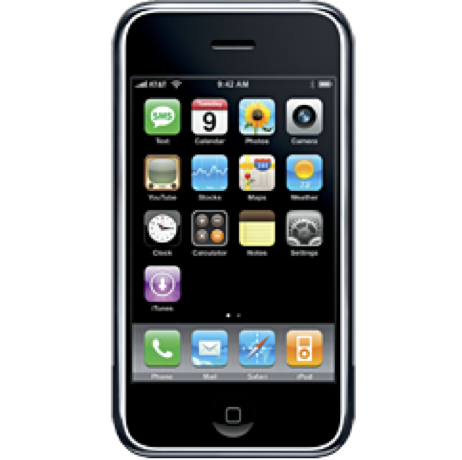
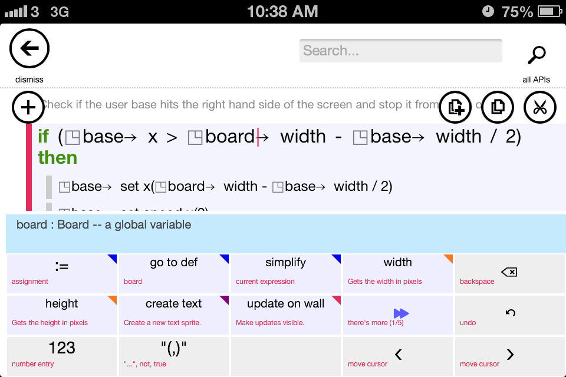
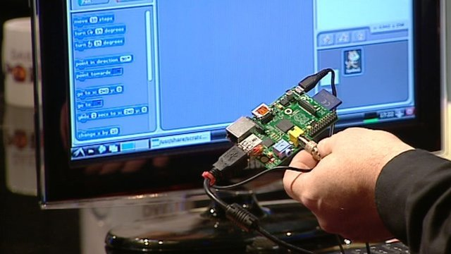

# Πρόλογος

> Αν υπάρχει ένα προηγούμενο στην ανθρώπινη εμπειρία που να δείχνει πως θα πρέπει να μοιάζει ένας υπολογιστής, αυτό είναι το μουσικό όργανο: μια επινόηση με την οποία μπορείς να διερευνήσεις ένα τεράστιο εύρος δυνατοτήτων μέσω μιας διεπαφής που συνδέει το μυαλό με το σώμα σου.
Jaron Lanier (1960- )

## Ανάγκη

Ο προγραμματισμός της διάδρασης (Programming Interaction) είναι μια σχετικά καινούρια γνωστική περιοχή, η οποία δημιουργήθηκε από τη μεγάλη αποδοχή που γνώρισαν τα συστήματα διάδρασης ανθρώπων-συσκευών (interactive systems) σε ένα ευρύτατο φάσμα εφαρμογών της καθημερινότητας και της εργασίας. Είναι τόσες πολλές οι ψηφιακές ανάγκες των ανθρώπων σε διαφορετικές πτυχές της ζωής τους (π.χ., ευζωία, ψυχαγωγία, μάθηση, εμπόριο, εργασία, κτλ.) και ταυτόχρονα δημιουργούνται συνέχεια τόσο νέες (πληροφοριακές) συσκευές (information appliances) όσο και νέες συνδέσεις μεταξύ τους, ώστε ο προγραμματισμός της διάδρασης αναδεικνύεται οργανικά σε πρωταγωνιστικό ρόλο στη σχεδίαση κατασκευή νέων ανθρώπινων και κοινωνικών δραστηριοτήτων. Το βιβλίο αυτό βασίζεται στην άποψη ότι ο προγραμματισμός της διάδρασης, εκτός του ότι είναι κάτι περισσότερο από το άθροισμα των επιμέρους τμημάτων, είναι κυρίως ένα νέο τεχνολογικό επίπεδο το οποίο έχει τη δυνατότητα να επαναπροσδιορίσει με θετικό τρόπο όλες τις ανθρώπινες και κοινωνικές δραστηριότητες.

Συνήθως, όταν έχουμε μια καινούρια γνωστική περιοχή (knowledge area), οι επιστήμονες θα προσπαθήσουν να την προσεγγίσουν μεθοδικά και σύμφωνα με τις τεχνικές που έχουν δουλέψει σε παρόμοιες περιοχές στο παρελθόν. Για παράδειγμα, στο παρελθόν, η εισαγωγή της τεχνολογίας της τηλεόρασης θεωρήθηκε συνέχεια της τεχνολογίας του ραδιοφώνου, οπότε αντίστοιχα η παραγωγή του περιεχομένου που φιλοξενούσε το νέο μέσο ήταν μια γραμμική βελτίωση αυτού που υπήρχε για το ραδιόφωνο. Με αυτό το σκεπτικό δεν ήταν καθόλου περίεργο που η τηλεόραση αρχικά ορίστηκε ως 'ραδιόφωνο με εικόνα' και με δεδομένο αυτόν τον σχετικά στενό ορισμό ήταν επόμενο το περιεχόμενο των εκπομπών τηλεόρασης τα πρώτα χρόνια να μην είναι κάτι παραπάνω από μια στατική εικόνα με ήχο. Έτσι, δεν είναι περίεργο που και ο προγραμματισμός αντιμετωπίζεται ως μια υποπερίπτωση της ευρύτερης περιοχής των μηχανικών (π.χ., μηχανολόγοι μηχανικοί), αφού έχει να κάνει με την κατασκευή και λειτουργία μιας μηχανής. Ταυτόχρονα, ήταν λογικό η διάδραση να αντιμετωπιστεί ως μια υποπερίπτωση της ευρύτερης περιοχής της εφαρμοσμένης σχεδίασης (π.χ., γραφίστες, εργονόμοι). Στην ειδική περίπτωση όμως του προγραμματισμού της διάδρασης και με δεδομένο ότι αναφερόμαστε σε μια σύνθετη περιοχή, διαφορετικού επιπέδου από τις επιμέρους, δεν έχουμε την ευχέρεια να κάνουμε τις παραπάνω απλουστεύσεις.

## Ιστορικό και πολιτισμικό πλαίσιο

Ο προγραμματισμός της διάδρασης έχει παραμείνει μια φευγαλέα περιοχή γιατί σε κάθε χρονική περίοδο έχουμε διαφορετικές τεχνολογικές μορφές υπολογιστών (π.χ., επιτραπέζιος, κινητός, φορετός, διάχυτος) και διεπαφών (interfaces) (π.χ., γραμμή εντολών, γραφικό περιβάλλον, χειρονομίες, φυσική γλώσσα) με τους χρήστες. Για παράδειγμα, ένας χρήστης υπολογιστών που έλαβε τη βασική, δευτεροβάθμια, και τριτοβάθμια εκπαίδευση τη δεκαετία του 1970 ή το πολύ μέχρι τα μισά της δεκαετίας του 1980 είναι πολύ πιθανό να έχει μεγάλη εξοικείωση με τη γραμμή εντολών και τους επιτραπέζιους υπολογιστές, αφού αυτή ήταν η βασική μορφή στα χρόνια της εκπαίδευσης του. Αντίστοιχα, ένας χρήστης που έλαβε την εκπαίδευσή του μετά το 2000 και κατά τη δεκαετία του 2010 είναι πολύ πιθανό να μην έχει καθόλου προσωπικό επιτραπέζιο υπολογιστή, αφού οι βασικές διεργασίες του χρήστη αυτήν την χρονική περίοδο (π.χ., αναζήτηση στον παγκόσμιο ιστό, κοινωνική δικτύωση, ψηφιακό περιεχόμενο, κτλ.) μπορούν να γίνουν εξίσου καλά, αν όχι καλύτερα, με έναν κινητό υπολογιστή. Βλέπουμε, λοιπόν, ότι στην πράξη ο ψηφιακός αλφαβητισμός είναι μια έννοια σχετική περισσότερο με τη δημογραφία και την ημερομηνία γέννησης, παρά μια διαχρονική αξία.

### Μορφές και συσκευές εισόδου

Οι συσκευές διάδρασης με τους υπολογιστές και αντίστοιχα ο προγραμματισμός της διάδρασης τους είναι έννοιες φευγαλέες τουλάχιστον για την περίοδο από τη δεκαετία του 1970 μέχρι και τη δεκαετία του 2010, αφού η διάδραση με τους υπολογιστές ξεκινάει από το τραπέζι και περνάει στα κινητά, φορετά, και διάχυτα συστήματα. Tη δεκαετία του 1970 η τυπική μορφή του προσωπικού υπολογιστή είναι ο επιτραπέζιος υπολογιστής χωρίς γραφικό περιβάλλον εργασίας, το οποίο όμως είναι ήδη αντικείμενο έρευνας στα εργαστήρια. Τη δεκαετία του 1980, η γραφική επιφάνεια εργασίας είναι εμπορικά διαθέσιμη, ενώ παράλληλα, το μεγαλύτερο μέρος του λογισμικού έχει περάσει από τη γραμμή εντολών στα μενού και στις φόρμες, οπότε το πληκτρολόγιο παραμένει η πιο δημοφιλής συσκευή εισόδου. Τη δεκαετία του 1990, η γραφική επιφάνεια εργασίας και το ποντίκι έχουν γίνει ο κυρίαρχος τρόπος διάδρασης με τον προσωπικό υπολογιστή, οπότε η συσκευή εισόδου ποντίκι και η έμμεση διάδραση (indirect interaction) με αντικείμενα στην οθόνη μέσω του δείκτη καθορίζει τα πιο δημοφιλή στυλ διάδρασης. Στα τέλη της δεκαετίας του 2000, ο κινητός υπολογιστής με οθόνη αφής φέρνει στο προσκήνιο τις χειρονομίες και την άμεση διάδραση (direct interaction) στην οθόνη, ενώ τη δεκαετία του 2010, ο υπολογιστής διαχέεται τόσο στο περιβάλλον όσο και στο ανθρώπινο σώμα, δημιουργώντας έτσι ένα οικοσύστημα συσκευών και εφαρμογών για τον χρήστη. Αντίστοιχα, ο προγραμματισμός της διάδρασης εξελίσσεται έτσι ώστε τα βασικά αρχέτυπα και εργαλεία να διευκολύνουν τον χειρισμό των νέων συσκευών του χρήστη, όπως είναι το πληκτρολόγιο, η οθόνη, το ποντίκι, η οθόνη αφής, κτλ.

### Λογισμικό και στυλ διάδρασης

Σχεδόν παράλληλα και πάντα αλληλένδετα με την εξέλιξη του υλικού και της φυσικής μορφής του υπολογιστή έχουμε μια εξέλιξη του λογισμικού και του στυλ διάδρασης με τον υπολογιστή, η οποία σχετίζεται περισσότερο με τις εφαρμογές και τις διεργασίες του χρήστη. Οι πρώτες δημοφιλείς εφαρμογές του προσωπικού υπολογιστή ήταν ο επεξεργαστής κειμένου και τα φύλλα εργασίας, τα οποία αποτελούσαν τον βασικό κίνητρο αγοράς κατά τις δεκαετίες του 1970 και του 1980. Τη δεκαετία του 1990 είχαμε τη μεγάλη υπόσχεση των εκπαιδευτικών και ψυχαγωγικών πολυμέσων τα οποία τελικά δεν έφτασαν στον τελικό χρήστη όπως αρχικά είχε σχεδιαστεί (μέσω της καλωδιακής τηλεόρασης), αλλά περισσότερο μέσω του οπτικού δίσκου, των κονσολών για βιντεοπαιχνίδια, και του διαδικτύου. Από το τέλος της δεκαετίας του 2000, έχουμε την επικράτηση των κοινωνικών μέσων δικτύωσης ως κύριαρχο στυλ διάδρασης με τον υπολογιστή. Πλέον, όλες οι εφαρμογές ανεξάρτητα από το αν έχουν στόχο την παραγωγικότητα, την εκπαίδευση, την ψυχαγωγία, τις εμπορικές συναλλαγές, την πληροφόρηση, βασίζονται ή τουλάχισοτν έχουν μια διάσταση κοινωνικού δικτύου. Αντίστοιχα, ο προγραμματισμός της διάδρασης εξελίσσεται έτσι ώστε τα βασικά αρχέτυπα και εργαλεία να διευκολύνουν τον χειρισμό των οντοτήτων του χρήστη, όπως είναι τα τοπικά αρχεία, τα πολυμέσα (multimedia), τα υπερμέσα (hypermedia), το κοινωνικό δίκτυο (social network), κτλ.

### Ο προγραμματισμός της διάδρασης

Η θέση του ψηφιακού αλφαβητισμού ως κάτι περισσότερο από εκπαίδευση στην απλή χρήση των τεχνολογιών πληροφόρησης και επικοινωνίας έχει διαπιστωθεί από τα μισά της δεκαετία του 1990, όταν τα γραφικά περιβάλλοντα διεπαφής με τον χρήστη (Graphical User Interface - GUI) είχαν κλείσει μια δεκαετία εμπορικής ζωής. Οι ερευνητές διαπίστωσαν ότι τα παιδιά που μεγάλωσαν με τη γραφική επιφάνεια εργασίας είχαν μεν μεγαλύτερη εξοικείωση με την παρουσία του υπολογιστή στη ζωή τους, αλλά είχαν πολύ μικρότερες δεξιότητες στη δημιουργική χρήση του. Η διαπίστωση αυτή οδήγησε σε μια σειρά από προσπάθειες τόσο στο λογισμικό (software) όσο και στο υλικό (hardware) υπολογιστών, έτσι ώστε να κρατήσουμε τη φιλικότητα των σύγχρονων υπολογιστών, χωρίς όμως να χάσουμε τις δεξιότητες που προσφέρει ο προγραμματισμός της διάδρασης. Για παράδειγμα, οι ερευνητές δημιούργησαν λογισμικό όπως τα KidSim, Etoys, και Scratch τα οποία βασίζονται στον οπτικό προγραμματισμό (visual programming) και στον προγραμματισμό με βάση παραδείγματα χρήσης (programming by example). Αντίστοιχα, για την περίπτωση του υλικού υπολογιστή δημιουργήθηκε το RaspberryPi, το οποίο είναι πολύ οικονομικό και συνδέεται με την τηλεόραση έτσι ώστε να έχει όσο γίνεται μεγαλύτερη διάχυση στους νέους χρήστες υπολογιστών που διαφορετικά θα μεγάλωναν μόνο με οθόνες αφής.

## Η αξία του προγραμματισμού της διάδρασης

Δεν υπάρχει καμία αμφιβολία ότι οι περισσότεροι άνθρωποι δεν ενδιαφέρονται συνειδητά για τον προγραμματισμό της διάδρασης, και κυρίως δεν σκοπεύουν να γίνουν επαγγελματίες του κλάδου. Ταυτόχρονα όμως, η διάχυση της αντίστοιχης τεχνολογίας σε όλους τους τομείς της ζωής τους κινδυνεύει να τους μετατρέψει σε απλούς καταναλωτές μια τεχνολογίας που δεν έχει μόνο καλές χρήσεις. Επιπλέον, τα πρόσφατα ιστορικά παραδείγματα έχουν δείξει ότι ακόμη και οι καλές χρήσης του προγραμματισμού της διάδρασης έχουν πολλές αρνητικές πλευρικές επιπτώσεις. Επομένως, η κατανόηση σε πρώτο επίπεδο και η δια βίου ανάπτυξη δεξιοτήτων σε δεύτερο επίπεδο στον προγραμματισμό της διάδρασης είναι μια αναγκαιότητα. Υπάρχουν δύο πολύ αναπαραστατικές αναλογίες για τη σπουδαιότητα του προγραμματισμού της διάδρασης.

### Προσωπική βελτίωση

Η πρώτη αναλογία δίνει έμφαση στην 'απειλή' που αφορά όσους αγνοούν τι τροφές καταναλώνουν. Οι ίδιες τροφές που είναι απαραίτητες για την επιβίωση μας, μπορεί να γίνουν απειλή, όταν δεν δέχονται τη σωστή διαχείριση, από την καλλιέργεια μέχρι τη διάθεσή τους. Υπάρχουν πάρα πολλοί που θα αναζητήσουν τις κατάλληλες πιστοποιήσεις και πολλοί που θα πάρουν την τύχη τους στα χέρια τους και θα αναλάβουν τον έλεγχο μεγάλου μέρους της αλυσίδας της διατροφής τους. Όπως ο έλεγχος των μηχανισμών της διατροφής είναι απαραίτητος για την καλή σωματική υγεία, αντίστοιχα, ο προγραμματισμός της διάδρασης είναι απαραίτητος για όσους δίνουν προτεραιότητα στον τρόπο που χειρίζονται την πληροφορία (information), η οποία έχει πρωταγωνιστικό ρόλο στο πως διασκεδάζουμε, επικοινωνούμε, μαθαίνουμε, δουλεύουμε, και εν τέλει στο πως ζούμε σε μια σύγχρονη κοινωνία της πληροφορίας. Σε αναλογία μπορούμε να πούμε, ότι η πληροφορία είναι ένα είδος γνωστικής τροφή για τον άνθρωπο και ο προγραμματισμός της διάδρασης είναι ο μηχανισμός που ελέγχει την παραγωγή, την ροή, και την κατανάλωση της.

Η δεύτερη αναλογία δίνει έμφαση στην 'ελπίδα' για όσους βλέπουν στον προγραμματισμό της διάδρασης ένα εργαλείο δημιουργίας. Υπάρχουν πολλοί άνθρωποι που ακούνε μουσική και παίζουν βίντεο-παιχνίδια, αλλά πάντα θα υπάρχουν και εκείνοι που θα θέλουν να παίξουν μουσική, να αλλάξουν ένα βίντεο-παιχνίδι ή ακόμη και να δημιουργήσουν μουσική και νέα παιχνίδια. Σε όλες αυτές τις περιπτώσεις, ο προγραμματισμός της διάδρασης είναι ο θεμελιώδης λίθος για την κατανόηση της δημιουργικής διαδικασίας. Σίγουρα δεν πρόκειται να γίνουν όλοι προγραμματιστές βίντεο-παιχνιδιών, όμως όλοι θα ωφεληθούν από μια καλύτερη κατανόηση των μηχανισμών λειτουργίας της ολοένα και περισσότερο ψηφιακής μας ζωής, όπως ακριβώς ωφελούνται όλοι οι άνθρωποι από μια μεγαλύτερη απόλαυση της μουσικής ακρόασης, όταν γνωρίζουν πως παίζεται και πως φτιάχνεται η μουσική, ακόμη και αν δεν γίνουν όλοι μουσικοί.

### Κοινωνικός μετασχηματισμός

Στα παραπάνω είδαμε ότι εκείνοι που κατανοούν τις διεργασίες επεξεργασίας της πληροφορίας, και ακόμη περισσότερο, αυτοί που μπορούν να τις επηρεάσουν ή ακόμη καλύτερα να δημιουργήσουν νέες, θα είναι οι πρωταγωνιστές στην επόμενη βιομηχανική επανάσταση. Εκτός λοιπόν από την προσωπική έκφραση και βελτίωση, η αξία του προγραμματισμού της διάδρασης είναι ανεκτίμητη στην κοινωνική κλίμακα καθώς και στην πολιτισμική διάσταση. Ο προγραμματισμός ενός υπολογιστή που δεν έχει διάδραση με ανθρώπους μπορεί να βελτιστοποιήσει (ποσοτικά) τη ζωή των ανθρώπων, αλλά δεν μπορεί να επιφέρει μεγάλες ποιοτικές αλλαγές. Για παράδειγμα, ο προγραμματισμός ενός αυτόνομα κινούμενου οχήματος είναι αναγκαία αλλά όχι ικανή προυπόθεση για να το χρησιμοποιήσουμε, αφού θα πρέπει να συνοδεύεται και από μια διεπαφή που θα οργανώνει τις μετακινήσεις μας, που άλλωστε είναι ο βασικός λόγος χρήσης ενός μεταφορικού οχήματος. Το φαινόμενο αυτό γίνεται ακόμη ισχυρότερο όταν η δημιουργία ενός οικοσυστήματος εφαρμογών που διευκολύνουν την εύρεση μεταφορικού μέσου (π.χ., Uber) αλλάζει με πολύ γρήγορο τρόπο την ανάγκη για αγορά ιδιωτικού αυτοκινήτου, καθώς και τον τρόπο που λειτουργεί η αγορά των ταξί.

Ένας νέος αλγόριθμος μπορεί να κάνει εφικτή, γρηγορότερη ή οικονομικότερη κάποια ανθρώπινη διεργασία, όταν όμως δημιουργούμε (ή απλώς αλλάζουμε) ένα πρόγραμμα υπολογιστή που έχει διάδραση με ανθρώπους, τότε η αλλαγή και οι επιπτώσεις της (θετικές ή αρνητικές) μπορεί να είναι πολλές τάξεις μεγέθους μεγαλύτερες. Για παράδειγμα, τη δεκαετία του 1990, οι επιστήμονες δημιούργησαν τον αλγόριθμο συμπίεσης μουσικής MP3, ο οποίος επέτρεψε τη συμπίεση των μουσικών αρχείων σε πολύ μικρά μεγέθη, ικανά να μεταφερθούν ακόμη και μέσα από σχετικά αργές γραμμές δικτύωσης υπολογιστών. Ο αλγόριθμός αυτός, σε συνδυασμό με νέα δικτυακά πρωτόκολλα και κυρίως με μια διεπαφή κατανοητή από τον μέσο χρήστη, έφερε στο προσκήνιο την ανταλλαγή μουσικών αρχείων. Αυτή η νέα πρακτική των χρηστών, μέσα σε λιγότερο από μια δεκαετία, μετασχημάτισε τη μουσική βιομηχανία και την παραγωγή μουσικής σε άλμπουμ. Επομένως, οι αλλαγές που μπορούμε να πετύχουμε με την κατανόηση του προγραμματισμού της διάδρασης είναι περισσότερες από την απλή βελτίωση ενός διαδραστικού προγράμματος υπολογιστή και φτάνουν μέχρι τον μετασχηματισμό της οικονομίας, της κοινωνίας και των αντιλήψεων για βασικές αξίες όπως αυτή της ιδιοκτησίας.

## Κοινό

Αυτό το βιβλίο απευθύνεται σε όσους σχεδιάζουν και κατασκευάζουν συστήματα διάδρασης ανθρώπου-υπολογιστή. Επομένως, είναι χρήσιμο τόσο σε επαγγελματίες όσο και σε φοιτητές μαθημάτων πληροφορικής, μηχανικής και σχεδίασης, αλλά και σε συγγενείς κλάδους. Με δεδομένη την εξάπλωση των εργαλείων της πληροφορικής σε πολλούς συγγενείς κλάδους, αλλά και σε ακόμη περισσότερους κλάδους που ωφελούνται ή ακόμη και επηρεάζονται από τις εφαρμογές της, το βιβλίο αυτό απευθύνεται σε όλους όσους συμμετέχουν σε μια ομάδα που καλείται να σχεδιάσει ή να βελτιώσει ένα διαδραστικό σύστημα βασισμένο σε ΗΥ που εμπλέκεται σε μια ανθρώπινη δραστηριότητα, ανεξάρτητα από τον ρόλο τους και ανεξάρτητα από τη βασική τους δεξιότητα.

Τόσο οι προγραμματιστές ΗΥ (developers) όσο και οι σχεδιαστές προϊόντων (product designers) θα ανακαλύψουν τη σημασία και τον ρόλο της σχέσης ανάμεσα στις δεξιότητές τους και στη διάδραση ανθρώπου-υπολογιστή, ενώ οι χρήστες διαδραστικών συσκευών θα γίνουν καλύτεροι στη συνειδητή επιλογή αλλά και στον χειρισμό των συσκευών τους. Τέλος, το βιβλίο αυτό απευθύνεται σε όλους εκείνους που πιστεύουν ότι η χρήση των ΗΥ στην καθημερινή ζωή είναι πολύ σημαντική για να αφήνουμε τον σχεδιασμό της άκριτα σε κάποιον άλλο οργανισμό. Όπως κάποιοι επιλέγουν να τρώνε κυρίως τα οπωροκηπευτικά που παράγουν οι ίδιοι, έτσι κάποιοι άλλοι επιλέγουν να καταναλώνουν μόνο την πληροφορία που έχουν επεξεργαστεί, με εργαλεία που καταλαβαίνουν και έχουν -εν μέρει τουλάχιστον- επηρεάσει.

Το βιβλίο αυτό δεν απευθύνεται σε όσους ενδιαφέρονται μόνο για την τεχνολογία ή σε όσους ενδιαφέρονται ειδικά για τη διάδραση με εξειδικευμένες τεχνολογίες. Η εστίαση στην τεχνολογική ανάπτυξη είναι μια αξιόλογη προσπάθεια, ειδικά όταν γνωρίζουμε τι ακριβώς θέλουμε να κατασκευάσουμε ή να βελτιώσουμε. Αντίθετα, το βιβλίο αυτό εστιάζει εξίσου στην τεχνολογία, στην ποικιλία και στον ευμετάβλητο χαρακτήρα του ανθρώπινου παράγοντα. Επιπλέον, το βιβλίο δεν απευθύνεται σε αυτούς που προγραμματίζουν τη διάδραση με εξειδικευμένες τεχνολογίες όπως είναι τα χειριστήρια ενός αεροσκάφους, ενός πυρηνικού αντιδραστήρα, και γενικά διαδράσεις που βασίζονται περισσότερο στο πρόγραμμα και στην πρακτική της εκπαίδευσης του χειριστή.

## Προαπαιτούμενες γνώσεις, υλικό, και λογισμικό

Το βιβλίο απευθύνεται σε απόφοιτους της δευτεροβάθμιας εκπαίδευσης και επομένως, η ανάγνωσή του και η εκτέλεση των δραστηριοτήτων δεν έχει άλλες απαιτήσεις πέρα από τις βασικές γνώσεις της δευτεροβάθμιας εκπαίδευσης στη χρήση των ΗΥ και του προγραμματισμού τους. Το βιβλίο μπορεί να χρησιμοποιηθεί τόσο από αναγνώστες που δεν έχουν γνώσεις προγραμματισμού, όσο και από αναγνώστες που δεν έχουν γνώσεις διάδρασης ανθρώπου-υπολογιστή, αφού και στις δύο περιπτώσεις περιέχει τα αντίστοιχα κεφάλαια με τις βασικές γνώσεις για αυτές τις περιοχές, καθώς και εκτενείς βιβλιογραφικές πηγές, πολλές από τις οποίες είναι ελεύθερα διαθέσιμες. Φυσικά, ο αναγνώστης που έχει τις επιμέρους γνώσεις, εν μέρει ή στο σύνολο τους, μπορεί να προχωρήσει γρηγορότερα στην ανάγνωση του βιβλίου, να ξεκινήσει από τα κεφαλαία του δεύτερου μέρους, και να ασχοληθεί περισσότερο με τις δραστηριότητες και την ανάπτυξη πρωτότυπων έργων.

Πέρα από τις γνώσεις, η παραγωγική ενασχόληση με ένα αντικείμενο που έχει στο κέντρο του τη λογική της κατασκευής ή τουλάχιστον της μετατροπής/επέκτασης επάνω σε υπάρχουσες κατασκευές, έχει επίσης προαπαιτούμενα και σε μέσα παραγωγής. Στην περίπτωσή μας, τα μέσα παραγωγής είναι το υλικό και το λογισμικό του ψηφιακού υπολογιστή. Η πιο κατάλληλη μορφή υλικού και λογισμικού για αυτό το βιβλίο είναι η περίπτωση του επιτραπέζιου υπολογιστή με λογισμικό επιφάνειας εργασίας, καθώς αυτή η μορφή υπολογιστή είναι η πιο ευέλικτη σε επεκτάσεις και αλλαγές στο λογισμικό σε όλα τα επίπεδα, από το πρόσθετο υλικό, και το λειτουργικό σύστημα, μέχρι τις γλώσσες προγραμματισμού. Από την άλλη πλευρά, δεν μπορούμε να αγνοήσουμε την εξέλιξη, ενώ είναι ιστορικό δεδομένο ότι στο παρελθόν η κάθε γενιά ανθρώπων μεγάλωσε με μια διαφορετική μορφή υπολογιστή. Για αυτόν τον λόγο, τόσο η θεωρία όσο και οι δραστηριότητες του βιβλίου δεν προάγουν κάποια μορφή υπολογιστή, αντίθετα, υποστηρίζουν τον αγνωστικισμό τόσο στο υλικό, όσο και στο λογισμικό. Σκόπιμα, λοιπόν, το βιβλίο έχει οργανωθεί και γραφτεί έτσι ώστε να επιτρέπει την πρόσβαση ακόμη και σε αναγνώστες με υπολογιστές τύπου tablet.
